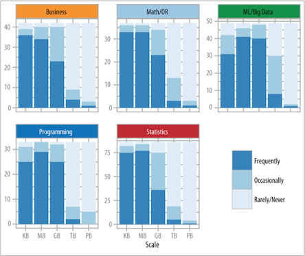

# Introduction

What if I told you that data science deals with "the collection, analysis, interpretation, presentation, and organization of data"?
That sounds about right, doesn't it?

Now what if I told you that was this was the definition of [statistics](https://en.wikipedia.org/wiki/Statistics)
according to the *Oxford Dictionary of Statistical Terms*.
Does that surprise you?
You wouldn't be the first person to wonder why statistics isn't the "science of data" and why we have this new term, "data science".
In fact, some people claim there is no difference.
Nate Silver--a very famous Bayesian statistician--says that data science *is* just statistics.

The economist Hal Varian said,

> I keep saying the sexy job in the next ten years will be
statisticians. People think I’m joking, but who would’ve guessed that computer engineers would’ve been the sexy job of the 1990s?

And he goes on to describe what he means by "statistician":

> The ability to take data – to be able to understand it, to process it, to extract value from it, to visualize it, to communicate[. I]t’s going to be a hugely important skill in the next decades, not only at the professional level but even at the educational level for elementary school kids, for high school kids, for college kids. Because now we really do have essentially free and ubiquitous data. So the complimentary scarce factor is the ability to understand that data and extract value from it.

>I think statisticians are part of it, but it’s just a part. You also want to be able to visualize the data, communicate the data, and utilize it effectively. But I do think those skills – of being able to access, understand, and communicate the insights you get from data analysis – are going to be extremely important. Managers need to be able to access and understand the data themselves. — Hal Varian, [Flowing Data](https://flowingdata.com/2009/02/25/googles-chief- economist-hal-varian-on-statistics-and-data/)

So why are we talking about "data scientist" and not "statistician"?
Would any of you be interested in "data science" if it was called "statistics"?
Why is this a book about the fundamentals of *data science* and not *statistics*?
There are some comical explanations:

> Data Scientist (n.): Person who is better at statistics than any software
engineer and better at software engineering than any statistician.
— @[josh_wills](https://twitter.com/josh_wills/status/198093512149958656?lang=en)

and:

> There’s a joke running around on Twitter that the definition of a data
scientist is ‘a data analyst who lives in California. — Malcolm Chisholm

I think Allen Downey is a bit closer to the truth:

> Having read [The Theory That
Would Not Die](https://www.amazon.com/Theory-That-Would-Not-Die-
ebook/dp/B0050QB3EQ) and [The Lady Tasting Tea](https://www.amazon.com/Lady-
Tasting-Tea-Statistics-Revolutionized-ebook/dp/B00633W4A2) recently, I suggest
the following conjecture:

> The term "data scientist" has been created to
describe what people want from a statistician, but which many statisticians fail
to provide because statistics, as a field, spent too much time in the 20th
century on problems in philosophy of science, and theoretical mathematical
problems, and not enough time on practical applications and the use of
computation to analyze data. As a result, many graduates from statistics
programs have a set of skills that is not a good match for what the market wants
them to do. This market vacuum is being filled by "data science."

> That's my theory, which is mine. — [Allen Downey](https://www.reddit.com/r/statistics/comments/1jygwl/is_data_scientist_just_a_sexed_up_word_for/)


This divide between "data scientist" and "statistician" is also related to the "Two Cultures" theory of machine learning and statistics.
Simon Blomberg said,

> machine learning is statistics minus any checking of models and assumptions -- Brian D. Ripley [Two Cultures](https://stats.stackexchange.com/questions/6/the-two-cultures- statistics-vs-machine-learning)

To which Bayesian statistician Andrew Gelman responded,

> In that case, maybe we should get rid of checking of models and assumptions more often. Then maybe we'd be able to solve some of the problems that the machine learning people can solve but we can't!

Although "machine learning" as such grew out of computer science, many of the same principles and algorithms in other engineering specialties were called "pattern recognition".
In fact, Bishop's textbook on machine learning is called [Machine Learning and Pattern Recognition](https://www.amazon.com/Pattern-Recognition-Learning-Information- Statistics/dp/0387310738) to cater to both audiences.

## Business Statistics
If you listen to the hype, organizations *need* data science today or they're going to fall behind their competitors.
Organizations today have tons of data and need data scientists to uncover the business value and actionable insights in that data in order to gain--or maintain--a competitive advantage.
But, honestly, companies have had data and analysts to pour through that data for decades.
The application of statistics to business processes is not new.
A business statistics course is often required of business majors in universities worldwide.

Here's a definition of [Business Statistics](http://www.statisticshowto.com/business-statistics/):

> Business statistics takes the data analysis tools from **elementary statistics** and applies them to business. For example, estimating the probability of a defect coming off a factory line, or seeing where sales are headed in the future. Many of the tools used in business statistics are built on ones you’ve probably already come across in basic math: mean, mode and median, bar graphs and the bell curve, and basic probability. Hypothesis testing (where you test out an idea) and regression analysis (fitting data to an equation) builds on this foundation.

> Basically, the course is going to be practically identical to an elementary statistics course. There will be slight differences. The questions will have a business feel, as opposed to questions about medicine, social sciences or other non-business subjects. Data samples will likely be business-oriented. Some subjects usually found in a basic stats course (like multiple regression) might be downplayed or omitted entirely in favor of more analysis of business data.

I think the only difference here between Data Science as such and Business Statistics is the sophistication of the tools used.
Data Science goes beyond using only elementary statistics and adds complex statistical modeling and machine learning.
And yet, elementary statistics is the best starting place whenever you start solving business problems and answering business questions.
It is an unfortunate and overlooked truth by those wishing to use the latest, shiny algorithms that most businesses can get by with models based on means, sums and rates.
The *hard* part is working with the data.

Nevertheless, the application of elementary statistics to good decision making started well over a hundred years ago.
Most famously, Gosset used statistics to improve the brewing process at Guinness in the early 1900's.
In order to do so, he developed an entire theory around working with small samples and published them under a pseudonym, "A. Student".
R. A. Fisher, a famous statistician and contemporary of Gosset's, spent part of his career analyzing data from agricultural field trials to determine the best fertilizer.
Why wasn't this "data science"?
Actually, I think it was.

Let's look at a more modern example, McDonald's:

> When you're as large as we are, we can't run the business on simple gut instinct. We rely heavily on all kinds of statistical data to help us determine whether our products are meeting customer expectations, when products need to be updated, and much more. The cost of making an educated guess is simply too great a risk. -- Wade Thomas in [Business Statistics: A Decision-Making Approach](https://www.amazon.com/Business-Statistics-Decision-Making-Approach-10th/dp/0134496493)

That sounds like data science to me.

But if we "google" for "data science for X" where *X* is "fertilizer analysis" we find [Monsanto](https://monsanto.com/innovations/data-science/) has far surpassed Fisher's work , when *X* is beer, we have [Empirical Brewery Brews with (Data) Science](https://oct.co/essays/empirical-brewery-brews-data-science), and when *X* is food products, we get, well, McDonald's in [7 Uses of Big Data in Food and Beverages Industry](https://www.newgenapps.com/blog/7-uses-of-big-data-in-food-and-beverages-industry).

## Defining Data Science

Why all the hand wringing?
If we're going to spend time learning how to do something, I think we should probably have general agreement about what that something is.
Additionally, anyone trying to find a job as a data scientist or doing data science will quickly be confronted by a mish-mash of job descriptions, some of which have only the most tenuous relationship to each other.
I have long since given up the idea that "data science is what data scientists do" because most organizations don't know what data scientists should reasonably be expected to do and a data *scientist* may end up doing more than data science.
Although it takes this to the extreme, here's a great example of one such job posting:

> [Company] is looking for a Data Scientist eager to use advanced analytical, machine learning and data transformation techniques as a means to develop practical tools and analyses that can help solve complex business problems; transforming volumes of data into actionable information. In some instances, you will be using languages like R or Python to employ newer techniques like tree ensembles, neural nets, and clustering to solve long- standing questions. **In other instances, it will be your responsibility to come up with solutions for problems that have not yet been identified.** In order to do so, the Data Scientist will have to be confident that they can solve a wide- range of problems using a variety of techniques—some known, some new, some yet to be created.

My favorite bit is the part I've emphasized in boldface: basically, you must solve unidentified problems.
How is that even possible?

[Big Data Made Simple](http://bigdata-madesimple.com/what-is-a-data-scientist-14-definitions- of-a-data-scientist/) has collected 14 definitions of a data scientist and by extension, data science.
Some are pretty good:

> “Data scientists are involved with gathering data, massaging it into a tractable form, making it tell its
story, and presenting that story to others,” — Mike Loukides

and some are pretty awful:

> Data scientist is a “change agent.” A data scientists is part digital trendspotter and part storyteller stitching various pieces of information together. — Anjul Bhambhri

and we've already seen the funny ones above.

Foster Provost in [Data Science for Business](http://www.amazon.com/Data- Science-Business-data-analytic-thinking/dp/1449361323) defines *data science* as fundamental concepts and *data mining* as the tools.
He quite correctly states that data science is not tools any more than biology is about test tubes.
A data science text that focuses on R, Hadoop, and MongoDB misses the point entirely (although you still need to learn how to use those "test tubes"!).
Here is a sampling of four of his 12 concepts:

* Extracting useful knowledge from data to solve business problems can be treated systematically by
following a process with reasonably well-defined stages.
* From a large mass of data, information technology can be used to find informative descriptive attributes of entities of interest.
* If you look too hard at a set of data, you will find something -- but it might not generalize beyond the data you're looking at.
* Formulating data mining solutions and evaluating the results involves thinking carefully about the context in which they are used.

There are about a dozen or so in his book and we will have cause to revisit them.
Still, I'm not sure that 12 maxims truly constitute "data science" but they might certainly inform the discussion.

### Venn Diagram of Data Science

One of the first attempts to describe what Data Science originated with Drew Conway and his [Venn Diagram of Data Science](http://drewconway.com/zia/2013/3/26/the-data-science- venn-diagram).
In many ways, it's still the best place to start any discussion about Data Science.

```{r venn, echo=FALSE, out.width='50%', fig.align='center', fig.cap="Drew Conway's Venn Diagram of Data Science"}
knitr::include_graphics('resources/venn_diagram_data_science.png')
```

Broadly speaking, there are three areas that combine to form Data Science: programming, math & statistics and domain knowledge.

Conway says "hacking skills" but I don't think that hacking skills are sufficient.
You really should know what it takes to field production ready software that is tested as much as possible, that has error handling, that is readable both by yourself, your future self (you six months from now) and other data scientists and engineers on your team and in organization.
For this reason, I buck the trend that data scientists on a team should use whatever language they're comfortable
with...everyone should use the same language whether it's R or Python or even Julia.
When the data scientist who does everything in Perl goes on vacation--or worse, leaves for a better job--the rest of team shouldn't have to scramble.
I also believe Data Scientists should be in Engineering and not Finance or Marketing and even better if they are *embedded* in other teams involved in their day-to-day problems and obstacles.

Why should you know software engineering and not just "hacking"?
It's true that not everything a data scientist does will end up in production.
If you just run a batch job on your local laptop once in a while, if you're working on a project using a local data set in Jupyter notebook, you may not need every bell and whistle in the software engineer's tool belt.

However, servers world-wide are littered withs scripts that were never meant to make it into production.
This makes such "personal" or "one off" scripts a slippery slope.
A one off becomes scripted, gets attached to `cron` and then goes into production all without error handling or tests.
You can think of exploratory data analysis as a version of "test first" applied to data, so you should do the same thing with your code: if you can find a simple way to test your code, do so.
There's nothing quite like having to explain to the CEO that the new campaign about to launch is misguided because there was a "bug" in the script.

Another area of expertise is "Math and Statistics".
What's interesting about the diagram here is that Conway views "Machine Learning" as the intersection of programming and math & statistics.
In fact, one could say that machine learning is a reification in code of math and statistics.
Still, I believe this is too narrow a view.
The diagram seems to imply that data science is applied machine learning.
This may not be what Conway intends so perhaps there are limits to *argument by Venn diagram*.

There are certain math and statistics that are important *as such* to data science.
These at least include linear algebra, optimization, probability, and statistics.
There isn't otherwise a special "data science math".
I bring this up only because I've been asked about "data science math" by past students; there's just math and some of it is very useful for data science.

## Data Science is Science

The final circle is Domain Expertise or Domain Knowledge.
In the *actual* sciences, domain knowledge consists of the theories, concepts and rules of thumb that are generally accepted by practitioners.
Acquiring this domain knowledge--along with the ability to add to it--is generally what it means to become a physicist, a biologist or an environmental ecologist.
At the fringes, this knowledge is the object of active research but it generally consists of the things everybody "knows".
This domain knowledge gives shape to the creation of new questions, new hypotheses, the design of experiments and the interpretation of results.

Your organization will have a body of theories and concepts, rules of thumb just like this but covering a much smaller domain than, say, physics.
Not all of it will have been collected scientifically--that's where you come in.
You can think of a data scientist at a particular organization as being an expert in that organization's domain.
A data scientist at Walmart is a "Walmartologist", a data scientist as Apple is an "Apple-ologist" and a data
scientist at Starbucks is a "Starbucksologist".
The key to the successful practice of data science is the marriage of general skills (data acquisition and analysis, statistics, machine learning, programming) to a specific, often very circumscribed, but small domain.

This is probably one of the most important aspects of being a data scientist: domain knowledge.
Oddly, it is the part of the position that you must get on the job.
You will get it from domain experts, stakeholders, and Josephine, who doesn't appear on the org chart, "but
has been here 15 years and knows everything".
Although I have recently started to see data scientist job postings that require experience in a given field such as human resources or healthcare.

Conway's Venn diagram segues very nicely into Max Shron's definition of Data Science in [Thinking with
Data](http://www.amazon.com/Thinking-Data-Turn-Information- Insights/dp/1449362931) that drives this point home:

> "To me, data plus math and statistics only gets you machine learning, which is great if that is what you are interested in, but not if you are doing data science. Science is about discovery and building knowledge, which requires some motivating questions about the world and hypotheses that can be brought to data and tested with statistical methods."

This is very good quote for several reasons.

1. It may very well be that you are only interested in math and statistics, machine learning. If so, you may find that data science is not your cup of tea.
2. It emphasizes *science*.
3. It emphasizes that you do *not* start with data, a point to which we will often return.

So, for Shron, there is this sense of doing actual science, of applying the scientific method, on the problems and data available in an organization, in the context of everyday life.
He then goes into his actual definition of data science:

> Data science is the application of math and computers to solve problems that stem from a lack of knowledge, constrained by the small number of people with any interest in the answers.

Still, it is an *applied* science.
It is not the quest for information for it's own sake.
Instead, you should always be working on solving a business problem or answering a business question.

If I appear to be belaboring this point, it is because I want to make sure there is no room for misunderstanding.
The angel you should keep on your shoulder throughout this book is that data science is not synonymous with machine learning, it is the application of the tools of science to everyday problems.
The question should not be, "what is the latest version of this algorithm? Is there a better one?" but "if I pulled a data set off the internet right now, could I apply this method to it?".
So data science is just science with the *priviso* that only a few people have any interest in insights that comprise some company's understanding of its churn rate as opposed to, say, the general theory of relativity or a cure for cancer.

John W. Forman in [Data Smart](http://www.amazon.com/Data-Smart- Science-Transform-Information/dp/111866146X) says,

> Data science is the transformation of data using mathematics and statistics into valuable insights, decisions, and products.

which is also good.

However, you don't start with data, you start with a question or a problem.
Otherwise, your data science team will not fare much better than the infamous [Underwear Gnomes](https://en.wikipedia.org/wiki/Gnomes_(South_Park):

1. Hire data scientist.
2. ???
3. Profit

You start with people, the domain knowledge and their problems and you end with communication and increased understanding.
Even in the not so grand exploration of a variable, "daily sales", Data Science is not *just* the rote execution of code and plotting charts.
You should always have a reason for why you did something and document it.
Communication is central.

So what is our working definition of data science?
While there are going to be exceptions, I believe the definition with the broadest applicability includes:

1. Communication - the identification of problems and questions as a goal, iterative communication on the progress towards reaching that goal, and the communication of the solution or answers. Decision making is a key aspect of this as well. Problems are solved and questions answered because someone wants to do something.
2. Data - problems and questions arise in the context of a real world processes. Data are our observations about those processes and the raw material for our analyses.
3. Modeling - whether it is statistical or machine learning, the central focus of data science is to build models of real world processes to answer questions or solve problems. It is no accident that most statisticians who say data science is just machine learning are *Bayesian* statisticians. Bayesian statistics emphasizes model building.

In a sentence, something like, "data science is application of modeling to data to solve problems or answer questions in support of decision making".
This definition also emphasizes something important: data scientist is a supporting role.

## Big Data

At this point, you might be wondering.
What about big data?
There so much hype surrounding "Big Data Science", that Dan Ariely quipped:

> Big data is like teenage sex: everyone talks about it, nobody really knows how to do it, everyone thinks everyone else is doing it, so everyone claims they are doing it... --  [Dan Ariely](https://twitter.com/danariely/status/287952257926971392)

The results in [Analyzing the Analyzers](http://cdn.oreillystatic.com/oreilly/radarreport/0636920029014/Analyzing_the_Analyzers.pdf) seem to back Ariely up.
Although "Data Science" and "Big Data" are often spoken of in the same breath and usually just a breathlessly, the survey showed that most data scientists don't work with anything like "big data" on a regular basis:

```{r dataset sizes, echo=FALSE, out.width='50%', fig.align='center'}

```


Part of the problem here is that the concept of "Big Data" has drifted.
And now some people are saying that it's all just "data" now--there's no such thing as "big data" and a lot of that has to do with technological improvements.

For a good discussion of the issues, read [Don't use Hadoop - your data isn't that big](https://www.chrisstucchio.com/blog/2013/hadoop_hatred.html) by Chris Stucchio.
It starts with a funny--but all too common story--of a client that wanted to use Hadoop on 600Mb of data.
The upshot: if your data is under 1TB, modern computers (8+ cores, SSD, 16Gb of memory in a *laptop*), databases (even SQLite!), and hard drives (external hard drives come in 4TB models) and Python are more than sufficient for your analytics needs.
This doesn't necessarily hold for your *production* needs.

## Data Science Case Studies

In order to get a feel for Data Science, we're going to present a few case studies in Data Science.
As we go through the main chapters of the book, you should come back here and see how much more you understand about what went into these examples of Data Science.

As you read or watch each the following examples of Data Science, take note of anything that interests you.
You should also answer the following questions:

1. What question where they trying to answer?
2. How did they approach the question?
3. Where did they get the data and what technique did they use?

### Signet Bank

> What can be gained from classification?  There are many iconic stories of how forward thinking companies anticipating business issues before they arrive – and then take action.  My favorite is story **Signet Bank**, whose credit card division was unprofitable, due to “bad” customer defaults on loans and “good” customers being lost to larger financial institutions who could offer better terms and conditions.  The answer, revolutionary at the time, was to apply classification to their customer data.  They separated the “Bad” from the “Good”, cut the “Bad” ones loose and nurtured the “Good” ones with offers and incentives.  Today, we know them as **Capital One**. [Data Science Foundations – Classification and Regression](http://blog.blumshapiro.com/blog/2015/01/09/data- science-concepts-classificatio-and-regression/)

But this isn't the whole story.
Signet Bank didn't have data with which to develop a classification algorithm so it had to generate it.
How did it generate the data? By offering customers _random terms_.
They accepted losses for 5 years in order to collect data from which they could learn what made a good customer that stayed and what made a bad customer who you shouldn't give a credit card to in the first place.

### Target

This particular story received national attention.
Basically, a father called Target to complain that his daughter was receiving targeted maternity coupons and it was distressing because his daughter wasn't pregnant.
The manager apologized.
A few days later, the father called back.
His daughter was indeed pregnant.
He apologized.

How did Target know that his daughter was pregnant?
Well, they didn't *know* but they had a good inkling.
Target collects data on all of its customers, assigning to each of them a "guest id".
Looking at actual maternity purchases, you can back up and see what did this person purchase last month? Two months ago? Three?

> As [Target statistician Andrew] Pole’s computers crawled through the data, he was able to identify about 25 products that, when analyzed together, allowed him to assign each shopper a “pregnancy prediction” score. More important, he could also estimate her due date to within a small window, so Target could send coupons timed to very specific stages of her pregnancy.

> One Target employee I spoke to provided a hypothetical example. Take a fictional Target shopper named Jenny Ward, who is 23, lives in Atlanta and in March bought cocoa-butter lotion, a purse large enough to double as a diaper bag, zinc and magnesium supplements and a bright blue rug. There’s, say, an 87 percent chance that she’s pregnant and that her delivery date is sometime in late August.

You can find out more by reading [How Target Figured Out A Teen Girl Was Pregnant Before Her Father Did](http://www.forbes.com/sites/kashmirhill/2012/02/16/how-target-figured-out-a-teen-girl-was-pregnant-before-her-father-did/).

### Walmart
Walmart also collects information on their customers.
In 2004, as Hurricane Frances was about to make landfall, Walmart started analyzing the purchasing patterns of customers prior to Hurricane Charley.

> The experts mined the data and found that the stores would indeed need certain products -- and not just the usual flashlights. "We didn't know in the past that strawberry Pop-Tarts increase in sales, like seven times their normal sales rate, ahead of a hurricane," Ms. Dillman said in a recent interview. "And the pre-hurricane top-selling item was beer."
> Thanks to those insights, trucks filled with toaster pastries and six-packs were soon speeding down Interstate 95 toward Wal-Marts in the path of Frances. Most of the products that were stocked for the storm sold quickly, the company said.

Common sense says that things like toilet paper, milk, eggs and bread are always the first to go in an emergency but discovering an increased demand for Pop-Tarts and Beer is definitely interesting.
We also see another example of how insights lead to decision making.
It is neither knowledge for knowledge's sake nor an opportunity to apply the latest machine learning algorithm.

You can find out more by reading [What Wal-Mart Knows About Customers' Habits](http://www.nytimes.com/2004/11/14/business/yourmoney/what-walmart-knows-about-customers-habits.html?_r=0).

### Obama Campaign

The first Obama campaign was already "data driven".

> In the 2008 presidential election, Obama’s targeters had assigned every voter in the country a pair of scores based on the probability that the individual would perform two distinct actions that mattered to the campaign: casting a ballot and supporting Obama. These scores were derived from an unprecedented volume of ongoing survey work. For each battleground state every week, the campaign’s call centers conducted 5,000 to 10,000 so-called short-form interviews that quickly gauged a voter’s preferences, and 1,000 interviews in a long-form version that was more like a traditional poll. To derive individual-level predictions, algorithms trawled for patterns between these opinions and the data points the campaign had assembled for every voter—as many as one thousand variables each, drawn from voter registration records, consumer data warehouses, and past campaign contacts.

By the re-election campaign, however, they had grown more sophisticated and moved to models of individual behavior.
They wanted to find *persuadable* voters.
While the Romney campaign tried to match the Obama campaign's data science team, they never got beyond the question, "is all this advertising working?".
The Romney team was one-tenth the size of Obama's.

As we all know, the application of data science to elections is a controversial topic following the 2016 election and the Brexit referendum.
Both Cambridge Analytics and Facebook have come under increasing scrutiny for their different roles in the application of data to those elections and data "breeches".
Events like these (as well as Walmart and Target) are bringing ethical concerns to the fore.
The most visible result of this concern was the passage and implementation of the European Union's General Data Protection Regulation [GDPR](https://gdpr-info.eu/).
Many believe something like GDPR will come to the United States and international firms have started general GDPR compliance as a matter of convenience.

You can find out more by reading [How President Obama’s campaign used big data to rally individual voters.](http://www.technologyreview.com/featuredstory/509026/how-obamas-team-used-big-data-to-rally-voters/)

### Identifying Place
Foursquare is a mobile app that allows you to share location information with friends by "checking in".
Blake Shaw of Foursquare made a presentation at Data Gotham 2012 that showcased the interesting questions that could be answered with this kind of location data.
He first started by animating the check-in data for New York City (Manhattan actually).
This showed interesting but not unexpected patterns of people checking in at work and transportation hubs, eateries for breakfast, work and then eateries for lunch, work, then eateries and home for dinner and the rest of the night.

The kinds of questions that can be asked of this data include:
1. What is a place? He showed check-ins that identified "Central Park" and "JFK Airport". Note that this is people checking-in and saying where they were. This process could be used to define a "place".
2. How do check-ins vary over time? Next he shows charts that show check-ins over time for three places. These charts show how these places exist in time relative to their check-ins. The coffee shop has a different pattern than the casual eatery which is still different than the more formal restaurant. However, there are interesting patterns...the eatery is busy late night on Fridays and Saturdays and the restaurant is busy at midday on Sundays...they serve brunch.
3. What places should be recommended for a weekend? It turns out that stadiums, flea markets, dim sum, and pool halls are much more popular on the weekends.
4. What are the characteristics of a neighborhood? For this analysis he compares Soho to the East Village and shows how there are more check-ins at offices in Soho and more check-ins at bars in the East Village.
5. What neighborhoods are similar? He demonstrates using this same information to identify neighborhoods that are similar.

All of this is interesting information.
It appears that Foursquare has finally started monetizing this data but that is the central challenge.
You can have a lot of interesting data and frame questions about it but are the answers something you can act on?
This is not to say that data can't be used for something other than to make money but the goal is usually some sort of insight that influences decisions.
These decisions might just make people happier.

You can find out more by watching [Big Data and The Big Apple](https://www.youtube.com/watch?v=0qt3WpAofI8).

### Pruning Trees in NYC

This next case study is interesting because it was done by someone at Media6Degrees, Brian Delessandro, during "donated" time.
The idea of donated time has made some headway into some companies.
Basically, it's an opportunity to use company resources to give back to the community.
It's a bit like open source, except you are doing analysis.
Although Delessandro is a work-a-day data scientist interested in his company's bottom line, Brian's decision to contribute was inspired by Jeff Hammerbacher's observation that,

> The best minds of my generation are thinking about how to make people click ads...and that sucks.

and the desire to contribute to the social bottom line.
As a side note, Jeff Hammerbacher left Cloudera to work in data science for medicine, specifically, depression.

The particular study that Delessandro was involved looked at the efficacy of "block pruning" in New York City.
During a typical day, there are very few fallen branches and trees in New York City.
This makes the typical workload easy to plan for in terms of staff and equipment.
During storms, however, there is typically a significant increase in fallen branches and trees.
This debris creates a public safety hazard (and inconvenience if they're blocking your road).
Block pruning involves sending crews to specific locations throughout NYC to trim trees to make the aftermath of a storm look like a typical day.
The question is, does this work?

The best way to answer this question would be to pick blocks at random separating them out into control (no block pruning) and treatment (block pruning) and monitor the blocks of the course of the next year or so.
However, as in many medical trials, this approach creates an ethical problem because the City is purposely *not* trimming trees in certain areas and allowing hazardous conditions to exist.
This rules out a traditional A/B test.

However, it turns out that NYC has a census of trees in the City ("The Urban Forest") that contain information about every tree in the city: species, age, location, etc.
They also have historical data on every maintenance action on every tree.
After aggregating this data to the block level, Brian was able use this *observational* data to build a model that related treatment (block pruning) to the outcome (work orders in the following year).

This particular study is interesting because of the presence of *confounding factors*.
A confounding factor is one that affects both the treatment and the outcome.
For example, blocks with more trees are more likely to have large tree and are thus more likely to get pruned.
Additionally, the crews have latitude in doing "surgical" pruning as they travel the city.
The original results actually show that pruning makes the city more hazardous!
Using a method designed to control for confounding factors, the data did show that pruning reduced future hazards by 13%.

Observational studies like this are very common in situations where controlled testing would create ethical problems.
For example, epidemiologists determined that cigarette smoking is hazardous not because they did an A/B test, randomly assigning people to control and treatment groups (and forcing the treatment group to smoke 1, 2, 3 packs a day).
Instead, they were able to use observational data to determine that there was a strong causal link.

This research is also an excellent demonstration of why you must have domain knowledge when doing data science.
You have to know where your data comes from and the actual, real world process that generates it.

My favorite quote of the presentation,

> Data scientist salaries are good but they're not country club good.

You can find out more by watching [Change the World in a Day](https://www.youtube.com/watch?v=UDBngQKHW2U).

### The Information Architecture of Medicine is Broken
This research by Ben Goldacre represents some interesting data science detective work in the field of medicine.
The cruz of his research is this.
He was interested in the efficacy of a certain anti-depressant ("the drug").
In the US, drugs are only approved by the FDA after they have undergone a certain number of clinical trials proving their efficacy.
We will have a lot to say about "efficacy" later but in the case of medicine this goes by the standard of "clinically significant results".
For depression there is a survey that sufferers take that determines a depression score.
The clinically significant result here is a lowering of one or more points on the scale.

As you might imagine, the result of one study might show that the drug lowers depression by 1.2 points on average.
Another study might show that that the drug lowers depression by 0.2 points on average.
Still another study might show that the drug lowers depression by 1.3 points.
With a sufficient number of studies, we can plot these points as a *histogram*.
By the Central Limit Theorem, this histogram should be relatively bell-shaped or have a Normal distribution.
What Goldacre found was that the actual plot looked like a bell curve cut in half, showing only the good results.
How is this possible?

As previously mentioned, in order for a medication to be approved by the FDA it must undergo a series of clinical trials.
The catch is that pharmaceutical companies can start trials and stop them when the results don't seem to be going in their favor.
They do not need to report the existence of those failed trials.
This explains why the results are not normally distributed.
As a result, Goldacre and others have tried to start capturing information about all clinical trials.

You can find out more by watching [The Information Architecture of Medicine is Broken](https://www.youtube.com/watch?v=AK_EUKJyusg).

### Love in the Time of Data
Daniel Chapsky is a Data Scientist at Snap Interactive, which produces a dating app called AYI ("Are You Interested?").
AYI is a recommendation "engine" (model) built on top of Facebook's social graph and other information.

One of the interesting things about this presentation is the use of data-driven personas.
Personas are very common in user experience/user interface (UX/UI) design.
By adopting a particular persona ("manager", "tech lead", "data scientist") designers can go through an application and see how well the application serves the needs of that particular persona.
AYI developed data driven personas of their customers using clustering.
The presentation talks about three different personas, "Rupert", "Pam", and "Blane", who each want very different things from a dating site and interact with its features in different ways.

This case study also demonstrates some central problems in working with data.
The most central here is feature engineering.
How do we take the data available from Facebook and external sources and turn it into actual features in a recommendation engine?
For example, Facebook interests can be noisy for some applications (for example, "Domino's Pizza", which is probably not a good dating interest) and too specific as well (for example, specific artists instead of "Jazz").
AYI tackled these problems by using external data to generate higher level *taxonomies* or labels.

Another aspect of feature engineering involves using the social network.
Certain personas ("Pam") are more likely to respond to a message if they have a friend in common (a feature).
They are also more likely to have a lot of friends (a feature).
Using the social network and AYI membership, AYI is able to better match "Pam" with people she is more likely to respond to.

Finally, in a dating app, attractiveness is going to play some kind of role.
Through exploring their data they noticed that women are picky regardless of age and men are pickier as they get older.
They then layered these inferences (common interests, friends of friends, pickiness) onto the social network and created a recommendation engine.

Note that since this presentation, Snap Interactive rebranded to PeerStream.
They are one of the largest social media companies with chat, video and dating apps that "piggyback" on the social network.
It appears that AYI became "FirstMet".
And for you GenXers out there, they have "0ver50" as well.
One has to wonder how they're faring in a post-Cambridge Analytics world.

You can find out more by watching [Love in the Time of Data](https://www.youtube.com/watch?v=-e-o4fCWp8U).

### Booz/Allen/Hamilton Data Science
This is a set of case study presentations by Booz/Allen/Hamilton (BAH) given at the Data Works Maryland Meetup.
During the introduction, BAH discussed how they organize their data science teams.
Since BAH is a consultancy, it is a little bit different than other companies and more project driven.
For any given data science project, they assign a software engineer, data scientist and domain expert.
Instead of trying to find a single unicorn with all the skills, they build unicorn teams.
There is some interesting information in the presentation that we will return to but our interest here is in the lightning talks showcasing case studies in data science.

**Malaria** kills an estimated 600,000 people a year and nearly 2 million are infected.
Poor countries are hit especially hard.
Africa has an interesting mix of good and bad infrastructure.
In terms of good infrastructure, Africa has a well developed cell tower and mobile phone system.

There was a malaria outbreak at a teak plantation.
The typical response is to treat the local bodies of water with chemicals to kill the mosquitos but that didn't seem to be working this time.
Someone made the observation that a large percentage of the workforce of this plantation was composed of migrant workers.
Accessing anonymized cell phone data, they were able to create a map of where all of these people had been over the previous weeks.
It turned out that many of them had traveled near Lake Victoria, hundreds of miles away.
When Lake Victoria was treated, the malaria outbreak at the teak planation stopped.

**Vehicle theft** is a major problem in metropolitan areas both in terms of property loss and public safety.
Using crime data and plotting it on a map of San Francisco, a data science team was able to identify several hotspots in the city for vehicle theft.
Concentrating on a single hotspot they saw that the hotspot was surrounded by three parks that made foot access (to and from) very easy.
Although one might think most vehicle thefts occur in the wee hours of the morning, looking at the data over time for this hotspot, they identified 9-10pm as the peak hours for crime.

Using this information as a model, the city deployed police to these specific locations at the specific times indicated by the model.
In response, there was a shift in the hotspots.


**Cancer** is a major health problem throughout the world for both poor and wealthy countries.
For those cancers with successful treatments, differential access to medicines can mean the difference between high and low mortality rates.
In this particular case, the medicine used to treat the specific type of cancer (neither the medicine nor cancer were named) is the result of a biological process.
Biological processes are difficult to control and have quite a bit of variation.
The goal of the company was to see if data could be used to decrease the variability of the process and increase the yield, making more medicine available and lowering the cost.

The available data was mostly time series: records of sensor measurements (pressure, temperature, etc.) over time as the process ran.
There was 10 years worth of the data, which measured in a several terabytes.
The team's theory was that runs with similar profiles--the movements of measurements over time--would have similar yields.
In order to measure similarity for time series, they used *dynamic time warping*.
In the end they were able to identify the conditions that lead to less variable, larger yields.

Unfortunately, these videos were removed in late 2018.

Hopefully these case studies will have given you a flavor for what can be done with data science.

## Conclusion

Although there isn't complete agreement about what Data Science is, there are enough commonalities in the different definitions to define a broad set of skills that comprise *doing* data science.
These skills include "hard" skills like programming, statistics, and machine learning as well as "soft" skills like communication and domain expertise.
For the purposes of this text, we will define data science to be "the application of modeling to data to solve problems or answer questions in support of decision making".
There are three main components here: problems/questions/decision making, data, and modeling.

We also presented a number of Data Science case studies.
By the end of this text, you should have a greater understanding of what went into each of these case studies and be able to do similar analyses.

## Review

1. What is the definition of statistics?
2. Why is it difficult to define data science?
3. What is the working definition of data science for this text?

## Exercises

1. In [Analyzing the Analyzers](http://cdn.oreillystatic.com/oreilly/radarreport/0636920029014/Analyzing_the_Analyzers.pdf), the authors identify four different kinds of "data scientists". Skim through the report. If you plan on becoming a Data Scientist, what kind of Data Scientist will you be?
2. Because of the interdisciplinary nature of Data Science, (ideal) Data Scientists described has having a [T-Shaped](https://en.wikipedia.org/wiki/T-shaped_skills) skill set. Looking at the skill sets documented in *Analyzing the Analyzers* above, what breadth skills do you think are lacking and what skill would you like to develop as your "depth" skill?
3. Kaggle used to provide an interesting list of Data Science [use cases](https://web.archive.org/web/20160118032500/https://www.kaggle.com/wiki/DataScienceUseCases) broken down by function and industry. Are there any interesting use cases in your function/industry? It's interesting to note that many of these use cases can be found in a typical business statistics book.
4. Find five data scientist job listings on an employment site. What's do they have in common? What's different? (You probably shouldn't do this at work...).
5. Find your own case study for data science (not just applied machine learning or "Artificial Intelligence").

