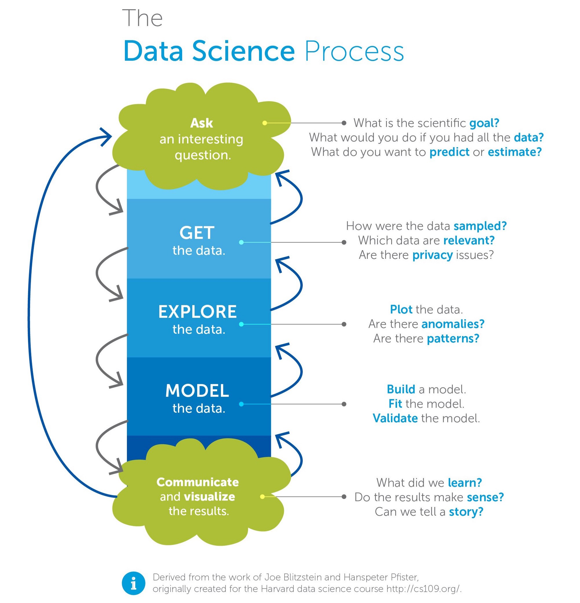
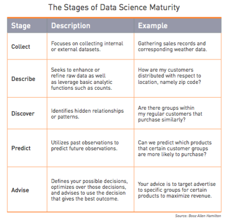
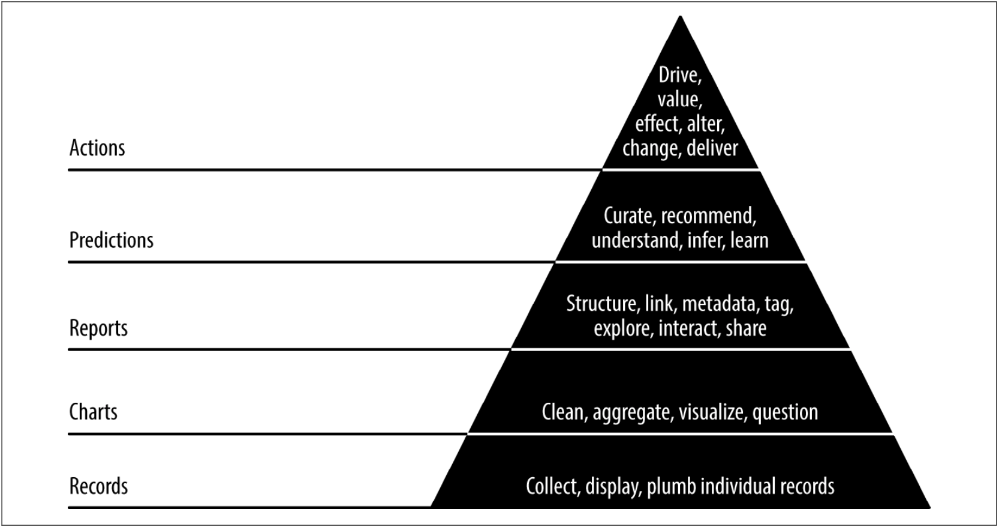

# Data Science Process {#process}

In this chapter we will discuss "The Data Science Process".
The Data Science Process is a framework that identifies the key steps to completing a data science project.
This Process includes with identifying problems in your organization by talking to various stakeholders, obtaining and scrubbing data, data exploration, modeling and finally "reporting" your results in some form that affects the operation of your organization.
We will use the "Green Cloud" model of Data Science in these notes.
However, because different organizations have differing degrees of data science experience, we will also talk about *stages* of data science and the data science pyramid put forth by Russell Journey.

We will then look at the first step in the "Green Cloud" model of Data Science, **ASK**, and explore at least one way we can improve communication at the onset of a data science project.
Finally, we will talk a bit about data science teams and data culture as the larger context in which the data science process unfolds.
There's a lot more to Data Science than algorithms.

## The Process

Unfortunately, mere algorithmic cleverness is not sufficient to ensure that a data science project succeeds.
If you can program a deep learning neural network using a [redstone computer in Minecraft](https://www.youtube.com/watch?v=BJCWOCVatfE), but you cannot properly identify a problem with business value in your organization, your data science team will ultimately fail.
If you can conduct statistical analyses but you cannot write clearly about your results, your results will go unused and your insights unheeded.

In the Introduction, we defined Data Science as:

> the application of modeling to data to solve problems or answer questions in support of decision making

and we emphasized that data science was more related to applying the tools and mindset of science to everyday problems than with "working with data", whatever that might mean.
We also emphasized that you will come to an organization with general skills but they will have their own, specific problems.
Biologists spend years learning the ins and outs of biology; you will have weeks to become an expert in your organization's processes, terms and domain knowledge.

The Data Science *Process* is an idealized view of the steps needed to go from the start to the "end" of a Data Science project.
The quotation marks signify that such projects rarely truly end.
These steps include things we generally think about (getting the data, building models) and those we do not (talking to people about the problem we're supposed to solve).

I think the two most important guiding principles in Data Science are:

1. **Communication** - solve the right problem for the
right people and talk about expectations and results constantly. Explain things
clearly. You need to be good at both written and oral communication.
2. **Simplicity** - follow the agile development dictum and start with the simplest thing that could possibly work. Focus on solving problems that add business value and not algorithms.

A quick search for "Data Science Process" will bring up any number of diagrams that differ in both fundamental and subtle ways.
If we search on Wikipedia (the final authority on everything, right?), we see a typical diagram of the "Data Science Process":

```{r fig1, echo=FALSE, out.width='100%', fig.align='center', fig.cap="The Data Science Process ([source](https://upload.wikimedia.org/wikipedia/commons/b/ba/Data_visualization_process_v1.png))"}
knitr::include_graphics('resources/process/data_science_process.png')
```

This is a very typical rendering of the Data Science Process.
It starts with the collection of raw data which is then processed.
This processed data is cleaned into a form suitable for exploration.
As you explore the data, errors and shortcoming may be detected in which case you go back to processing data.
When the data is cleaned sufficiently, you progress to models and algorithms.
Depending on the use case, the results of your modeling are either deployed as a data product (for example, a recommendation algorithm) or reported back to stakeholders who use the insights discovered to make decisions.

This characterization is fine as far as it goes but it falls a bit short by starting with the data.
**This gives rise to unreasonable expectations on all sides.**
First, stakeholders and decision makers think that just throwing data at "Data Scientists" will make money.
Second, data scientists, perhaps with little training outside of academia, think that just sifting through data for six months will make a valuable contribution to the organization.

This is the path to "nothing appears to succeed and everyone is laid off, Data Science is hype." and harkens back to those nefarious and misguided Underwear Gnomes from *South Park*.
As Forrester reports, 99% of companies think data science is an important discipline to develop yet only 22% of companies are seeing significant business value from data science.
I have personally witnessed the dissolution of several data science teams and heard of several companies that either laid off entire teams of data scientists or were not hiring data scientists until they had "figured out" their data science story.

I will return to the "fork" in this process that generates either reports in support of decision making or data products in support of business in a moment.

```{r fig2, echo=FALSE, out.width='100%', fig.align='center'}

```

The Green Cloud model is more explicit about the starting point for the Data Science process: ASK - asking a question (or asking for problems to solve).
Specifically, it asks you to identify a goal for the data science project.
It also asks you to think about what you would do if you had all the data at hand.
We also ask what kind of problem we're going to solve: prediction or estimation (which I would call "explanation").
More generally, we need to talk about our ideal solution to the problem and what kind of model it might entail.
Although not show here, we may need to address any ethical and or legal issues associated with solving this problem.
We will talk about ways of framing the ASK step later in this chapter.

The GET step involves obtaining data which may be inside or outside the organization.
We also need to identify which data are relevant.
This is also the place to address privacy issues related to the data (as opposed to the problem or question).
"Extract, Transform, and Load" (ETL), "Data Munging", and "Data Wrangling" are often associated with the GET step.
Data Scientists often spend 80% of their time in this step (although it does blur into the next one a bit).

The EXPLORE step involves looking at the data and trying to identify anomalies and problems.
This step is often associated with Exploratory Data Analysis (EDA).
The first pass at EDA might involve looking for anomalies and errors in the data.
When such problems are discovered, we often have to go back to the GET step.
The second pass at EDA will concentrate on visualization and the identification of patterns that will help us understand the data and make our modeling more effective.

The MODEL step is where we build representations of the data that help us solve the actual problem or answer the question.
Models can be simple, if we want to know what our current churn rate is, or complex, if we need to identify entities in images.
Simple models using averages, rates, and linear models are often all that is needed here, for most organizations.

The REPORT step is where we communicate our results back to the organization.
Here we try to connect the insights we have unearthed back to the decision makers in the organization whether it is through a report, an email or a dashboard.
Although it might be slightly controversial, I generally identify the creation of data products with *machine learning engineering*.
This doesn't mean, however, that some data scientists won't be doing some machine learning engineering.

My perspective on this topic is the result of several years of working on recommendation engines.
One of the most frustrating things about working on recommendation engines--for me--was that we never learned anything about the customer's preferences.
Sure enough, we picked algorithms, engineered features and deployed recommendation engines.
We also conducted A/B tests to see which one was best.
But none of the techniques we used, from selecting models, obtaining data, identifying features, training and deploying models, and evaluating the results was outside what you would learn in a machine learning course.
And, at the end of the day, we had no insights into our customers' behaviors (although we did make more money, which was good).
And this was frustrating to me because I wanted to learn cool things about our customers.
Put differently, if this is data science then every use of machine learning is data science and that doesn't seem right.

This is not to say that data scientists won't do applied machine learning or what I would call "data products".
But this goes back to the idea (which I reject) that data science is what data scientists do.
Data scientists *may* do data science and machine learning engineering.
In any case, this is a provisional distinction that may eventually disappear.

As indicated by the arrows, we will very often have to go back and revisit previous steps.
There are some very "tight" loops in the GET, EXPLORE, and MODEL steps because, as we will see, your modeling may reveal deficiencies in the data you have at which point you need to go back and apply different transformation or get new data, all of which will need to be explored.

At the end, we may have more questions or problems that need solving and the process starts all over again.
As we will see, it's best to keep focused on a single problem and "solve" it then come back to the questions and problems raised.

## Side Note on Data

We're going to talk about data a lot in this text.
Organizations have always had databases and we already mentioned that Gosset was trying to improve brewing using statistics well over a 100 years ago so
so you might ask yourself, why are Data and Data Science such a big thing *now*?

The flippant answer is that no MBA has ever understood what their business statistics course was trying to tell them.
And in a world of specialization, this is, perhaps, not unexpected and perhaps it was never realistic.
After all, MBAs and Business Majors take accounting classes as well but they still hire CPAs.
A better answer, I think, hinges on four factors that converged over the last decade:

1. Ubiquitous computing.
2. Cheap data storage.
3. Logging.
4. Success of Machine Learning.

Ubiquitous computing is huge for a number of reasons.
Your iPhone has more computational power than the original Cray.
Your laptop is beyond what anyone could even dream of a few decades ago.
This means that organizations--and individuals--have more computing power at their disposal than ever before to run simulations, learn a programming language, do machine learning, etc.
It used to be very expensive and time consuming to do any of these things.

Cheap data storage means we can just save everything and look at it later.
This has possible legal and ethical ramifications which we should not fail to recognize and discuss but in general, this is a great boon to organizations.

Logging is very important for the rise of data science which is a bit weird because it's more or less a side effect of the rise of the internet.
By logging every interaction on a webserver, we were inadvertently taking measurements of human behavior that we could never have done before.
Let's compare two scenarios.
In a brick-and-mortar grocery store, you go up and down the aisles the way you want, you look at products, you pick some up, some are put in the cart and others are put back.
In the days before UPCs, you just checked out.
In an online store, all of that is controlled and audited.
You are shown a particular order of products.
Your search for specific products is logged.
Every page you visit is logged.
Anything you put into your cart is logged and everything you take out of your cart is logged. Even for non-ecommerce situations, there are important differences between old style computer systems and ones with logging.
For example, in old style computer systems, when you update your address in a database, the old address is typically gone.
When you update your marital status, the insurance company's database forgets that you were ever single.

The logs, on the other hand, remember everything.
They are records of event streams that are much more interesting.
Consider a log that records everything you look at on Amazon and the cost of doing the same thing at the local Safeway.

This is actually why the bank account example in Object Oriented Programming is so misleading.
Banks keep records of *transactions*.
Your account balance is a derived value (although there are cached starting points that they work from, normally coinciding with statement periods).

Finally, the broad success and availability of Machine Learning algorithms is finally making it possible to include them in everyday projects.
This wasn't usually the case with Artificial Intelligence (Does anyone know what an "Expert System" is anymore?).
Of course, data science isn't *just* machine learning and machine learning may not even be the most important part of data science.

## Stages of Data Science

Data Science teams, projects, and even models can go through different stages.
Do we have the data for this project?
Do we have the expertise on this data science team?
What kind of model do we need for this problem?
There are lot of options and the *right* option is influenced by a host of factors.
These factors may include:

1. The appropriateness of a technique or algorithm to the problem. Some approaches really are overkill. If a stakeholder wants to know about purchase rates, you don't need to train a deep neural network. On the other hand, if you have an application that is heavily dependent on "machine" vision and recognizing shapes in images, you may very well need to start with the state of the art.
2. The availability of data for the problem. We often talk about how much data is produced everyday but we don't often stop to consider if any of the data is actually useful or if the right data is being collected. You may have a problem for which your organization is not collecting data (and needs to start) or has been collecting the wrong data (and needs to fix or improve the data being collected).
3. Historical approaches to the problem in your organization. In the past, a financial analyst has always just calculated your performance metrics but now you want to get more sophisticated. You may want to change the metrics, start calculating confidence intervals for them and even projecting them. On the other hand, you may come to a problem that has already seen great improvements from linear regression and your task is to see if a new model or new features will improve performance. On *new* problems, you should start simply but on *historical* problems, you have to take into account the work that has gone before.
4. The maturity of the data science efforts in the organization. The maturity of data science in the organization affects your choices in a variety of ways.

With fledgling data science teams, you often need to concentrate on breadth.
With so many different problems, the return on investment (ROI)  to data science is often highest at the start.
That is moving from a non-data driven approach to a data driven approach is often has the biggest impact on the problem.
Moving to more sophisticated models can bring incremental increases in returns but often not as big as the first models.

I saw this first hand at Company X.
We struggled with building complicated models we "knew" should work but didn't.
At one point we switched to a very simple model and got a huge lift over the "conventional" practice (in data science, "lift" is the differential increase in something like review; you will often see "lift" mean "effort" in product management circles. They don't mean the same thing at all!).
And although we spent months looking for better models, most of the time they were only better than the first model by small amounts.
Because of the effort involved in switching models, we required a new "winning" model to have a lift of at least 3%.
We never replaced the simple model.
So we concentrated on breadth, bringing data science to other parts of the company in order to get those large initial payoffs.

As the data science efforts in an organization matures, there can be more room for specialization.
In "One Data Science Job Doesn’t Fit All", Elena Grewal talks about this at AirBnB:

> We started off as the “A-team” — Analytics team — with the first hire an “Analytics Specialist.” In 2012, I was hired as a “Data Scientist.” Later, we hired a “Data Architect,” to tackle data quality, then a “Data Analytics Specialists” to help solve gaps in data access and tools. Then we saw additional needs in machine learning so we hired “Machine Learning Data Scientists.” These title evolutions were both reactions to team needs and also to the competitive landscape. We became the “Data Science” function in 2015, though we still use “A-team” because it’s fun and has a history we value.

She goes on to explain how Data Science has evolved into three tracks: Analytics, Algorithms, and Inference. The *Analytics* track is focused on asking questions and surfacing answers in the form of dashboards. The *Algorithms* track is focused on applying machine learning to improve business products. The *Inference* track is focused on improving decision making and measuring the impact of initiatives.

It is interesting to observe that in her post, Grewal notes that people in the Analytics track often feel like they are undervalued relative to those in the Algorithms track even though they
At Company Z, where I worked, we had a similar tension when the Business Intelligence (BI) team paired up with the  Data Science team.
I often think of the Analytics and Inference tracks as "BI++" (after C++).
At Company Y, there was a similar division between those who worked on Inference and those who worked on Algorithms.
I am aware that this division exists at many other organizations as well.

AirBnB is relatively mature, however.
In an organization just getting started with data science may either focus just on Inference or have a small team that does Inference, Algorithms, and Inference.
This is somewhat biased towards internet companies.
Non-tech companies may not have an Algorithms track at all.

Ganes Kesari talks more about the evolution of Data Science teams in "What are the 3 Stages where Data Science Teams Fail?". First, he echos a sentiment that will be a major theme throughout this text:

> Going by any analyst estimate, hundreds of billions are being thrown in by companies to solve problems with data. The key ask is to draw actionable insights that can drive business decisions. Building of predictive models is the top-of-mind recall with the very mention of the word, ‘analytics’.

> However, considerable business value in data science comes with the right application of exploratory analytics or statistical techniques. While AI or Deep learning have their rightful place, they are not silver bullets for Business ROI to every data problem.


But he continues, discussing the evolution of data science teams from "Makeshift Camp":

> Similarly, too much of preparation for an ideal mix of skills could lead to analysis-paralysis. Onboard generalists, people who can cover many of the needed skills in analytics (say statistics, programming and information design), even if only to a limited depth. The need is for survivors who flourish in scarcity, wear many hats and instill dynamism to solve any given challenge.

to "Thatched House":

> Having won small victories with the initial team and established a purpose, the data science team can start fanning out into adjacent usecases. Slowly expand the scope of problems addressed and deepen partnership with users. Initial pilots can now mature into longer initiatives spanning a quarter or year.

> Showcase enhanced ROI to justify the next level of investment needed. While things may start to work in one’s favour, avoid over-committing in this interim stage. Start specialising by investing in few deeper areas (say Sales analytics, NLP), while continuing to be shallow and get job done in others (say design).

to "Palatial Home":

> As an evolved entity, the data science team is essentially a mature business unit now. With specialised domain expertise and grasp over all key data science skill areas, the team is now ready to handle sufficiently complex problems, across a wide breadth of areas.

> No longer faced with existential challenges, the team’s mandate can be deeply woven into long-term business objectives of the stakeholders. Teams could be structured with a vertical alignment, or as technical centres of excellence alias horizontals, or maybe along a hybrid, matrix structure which goes in between.

I have seen firsthand (and heard many times second hand) stories about data science teams that did not survive their existential challenge.
If your organization does not currently have a data science team or if you're part of a business unit spinning up their own data science capabilities, do not necessarily look to the Facebooks and AirBnBs of *now* for inspiration but how their Data Science teams started out.

Booz Allen Hamilton describes these *Stages of Data Science* maturity in a slightly different but useful way.
They even go down one level...the first state of data science is collecting data and having it available.
This is another landmine in the rush to having data science at an organization.
If you do not have the data or it is not accessible to the data science team, your data scientists will be twiddling their thumbs.
And while data scientists *should* have the basic skills needed to obtain data from internal databases and external APIs, a lack of data and or data infrastructure can severely limit what the team is capable of accomplishing.
You cannot hope to long endure if you have a automatically generated weekly report that runs from Jane's laptop and requires constant supervision.

```{r fig3, echo=FALSE, out.width='70%', fig.align='center', fig.cap="The Stages of Data Science Maturity ([source](http://www.boozallen.com/insights/2015/12/data-science-field-guide-second-edition))"}

```

The first stage of data science is **Collect**.
The organization needs to collect (internal) or obtain (external) the data.
The provenance of the data needs to be maintained (where did this data come from?).
Additionally, in this stage you are going to need the pipelines that move data from place to place.
At first these might just be data scientists with the requisite skills.
As the effort matures, however, this can evolve into a data infrastructure that moves data from production and external sources to data warehouses.
The provided example is also illustrative of the idea of data *enrichment*.
In this case, we want to see if there's a relationship between sales (internal data) and weather (external data).
The weather data *enriches* the sales data.

The second level, **Describe**, was alluded to above.
This is always where you start.
It is foundational not only because of Exploratory Data Analysis but also because simple rate calculations--with or without data enrichment--can be very illuminating.

The third level, **Discover**, involves either visualization or clustering.

The fourth level, **Predict**, involves anything that's a simple as linear and logistic regression all the way to random forests and neural networks and, finally, deep learning.
We will spend a lot of time on the simpler, *interpretable* approaches in this text.

The fifth level, **Advise**, bring the previous levels together along with A/B testing and experimental design.

Note that these stages can apply to specific *projects* as well as the entire data science effort of an organization.

## Agile Data Science Pyramid

*Agile Data Science* is a wonderful book by Russell Journey that is hard to classify.
It takes a practical and hands-on approach to building an entire data science project iteratively--as you expect from something with the term "Agile" in the title.
It applies the "Agile" philosophy to doing data science.
The Manifesto for Agile Software Development states:

>We are uncovering better ways of developing software by doing it and helping others do it.
> Through this work we have come to value:

> Individuals and interactions over processes and tools
> Working software over comprehensive documentation
> Customer collaboration over contract negotiation
> Responding to change over following a plan

>That is, while there is value in the items on the right, we value the items on the left more.

Taking these four times together, the general idea was that software engineers would consult directly with end users to build software with the features they actually wanted to do the work they needed to do.
The software would be built iteratively starting with the basics and enhanced as additional "user stories" were uncovered and implemented.

Journey wants to apply this method to data science.
As a result, some of the focus shifts.
For example, data science as science does not necessarily have predetermined results that can be managed in a predictable way.
Although it is widely recognized that building software is not like building cars, you can still get an approximate estimate from a programmer as to when a new feature will be added.
I have been asked by product managers when I thought I would find a more successful model!
This isn't much different than asking when I'll find that cure for cancer.

As a result, data scientists need to be very communicative about their process and progress.
If you shoe horn data science into a software engineering model, the stakeholders will often be frustrated.
I remember being the only data scientist at a smaller company and having to report each morning at the "stand up" (meeting), what I had done and what I was doing.
While the software engineers had different bugs and features every day, I was almost always working on the same thing.
The method of reporting didn't match the work.
However, there were also some lessons I hadn't yet learned about communicating progress over results.
Journey formalizes the iterative application of data science to a problem in the Agile Data Science Pyramid:

```{r fig4, echo=FALSE, out.width='100%', fig.align='center', fig.cap='Agile Data Science Pyramid'}

```


With start with the base, **records**.
In this case, you are building the infrastructure for data scientists and stakeholders to get access to the raw data themselves.
This is related to the *GET* step above.

The next layer involves using **charts** to display aggregate information.
This layer is followed by **reports**.
These layers are related to the steps in the Data Science Process, both ASK and EXPLORE.
In *charts*, we produce visualizations to generate questions and problems.
In *reports*, we are moving away from unstructured exploration to structured linking and reporting.

The next layer is to add **predictions**.
Here we are taking the previous layers and moving towards insights and recommendations for action.
This fits well with the MODEL step of the Green Cloud process.
The final layer is *actions* in which the previous layer leads to actual changes in organization strategy and tactics or is integrated into company products.

There are a lot of different ways of characterizing the Data Science process as well as the evolution of Data Science teams and projects.
For most of the text we will stick with the Green Cloud model except where the other models have an interesting perspective as we delve more deeply into the details.
We'll start here with the ASK step.

## ASK

So we start at the start.
I assume that our organization has been collecting data as part of its regular business process and perhaps online presence.
It might have done some marketing surveys.
If not, there will be scant little for data *scientists* to do and they need to be hiring some data *engineers*.
Let's assume that "having data" is a solved problem for now...although our organization might not have all the *right* data.

In the introduction to their Data Science uses cases, Kaggle provides a good set of starting questions for any data science project:

1. What problem does it solve and for whom?
2. How is it being solved today?
3. How could a different solution (data driven) beneficially affect business?
4. What are the data inputs and where do they come from?
5. What are the outputs and how are they consumed (predictive model and a report? recommender and an email? statistical analysis and a dashboard?)
6. Is this a revenue leakage ("save us money") or a revenue growth ("makes us money") problem?

These are great prompts for the ASK step and are likely to lead to better conversations.
Additionally, I would that the question or problem posed should be meet the general characteristics of a scientific question: is it falsifiable?
For example, "Increase customer satisfaction" is not a falsifiable problem or question.
Not only must have you have data but you also need to arrive at a *metric* with which to gauge success.

However, we can elaborate on the ASK step a bit more by following the framework proposed by Max Shron [Thinking with Data](http://www.amazon.com/Thinking-Data-Turn-Information- Insights/dp/1449362931) which also has a handy mnemonic, "CoNVO".
The goal of this framework is to make sure we pick an appropriate problem and set expectations about the solution appropriately.
I like the CoNVO approach because it includes mock ups for the solution and thus plans for the final step in the Green Cloud, REPORT.

It can also be used to track progress.
Anytime you start to diverge from what was agreed upon during the "CoNVO", it's time for another "CoNVO".
That being said, I have only ever used this framework *implicitly*.
I once brought up the idea of using it explicitly and got a bunch of blank stares.
Apparently not everyone reads the same books I do!
Don't get overly hung up on details, though.
This is a tool.

## CoNVO

As we stated previously, an interesting question is one that solves a
business problem when answered.
One way to make sure you have an interesting question is to follow the CoNVO framework.
**CoNVO** stands for **Co**ntext, **N**eeds, **V**ision and **O**utcome.

* **Context** - What is the context of the need? Who are the stakeholders and other interested parties?
* **Need** - What is the organizational need which requires fixing with data?
* **Vision** - What is going to be required and what does success look like?
* **Outcome** - How will the result work itself back into the organization?

You can see how the Kaggle questions fit into this as well, mostly during specifying the Need.
For any Data Science project, you should know the CoNVO even if you don't explicitly use those terms.
Keep refining the CoNVO as you delve into the data.

Let's start with a specific example.
In the book, Shron describes a situation faced by a university:

> Suppose that a university is interested in starting a pilot program to offer special assistance to incoming college students who are at risk of failing out of school (the context). What it needs is a way to identify who is at risk and find effective interventions (the need). We propose to create a predictive model of failure rates and to assist in the design of an experiment to test several interventions (the vision). If we can make a case for our ideas, the administration will pay for the experiments to test it; if they are successful, the program will be scaled up soon after (the outcome).

So we have a **context** that includes the identification of a problem: some incoming college students are at risk of failing out of school and the university is interested in starting a pilot program.

The **need** is to identify who is at risk and what interventions are effective.

The **vision** is a proposal to create a predictive model of failure rates and to design experiments to test different interventions.

The **outcome** is to communicate the findings and if they are robust, scale up the program.

There's a lot to talk about here. First, the *context* and *need* define an interesting question that solves a business problem (throughout this text, I equate "business" with both profit and non-profit).
Second, the *vision* and *outcome* are a dry run of the blue steps get/explore/model and a proposal for the final communication step.
You can think of the CoNVO as a dry run or meta process that happens before the actual Data Science process.

With regard to the specific elements, most importantly, the need is *not* a dashboard or Hadoop or deep learning.
A data product or tool is a potential solution; it is not a need.
Shron notes, "A data science need is a problem that can be solved with knowledge, not a lack of a particular tool."
The solution is never "the CEO needs Tableau".
At Company Z, I built a dashboard from scratch that included logging so that I could see the most used features.
That's right, I went meta with my data science.
When people said "we need this", I could verify which features were and weren't being used.
If a feature wasn't being used, I could ask, "why?".

It's worth noting, however, that if your project has already been in progress for sometime, many of these questions will already be answered for you.
While this might constrain your available options, you should feel free to investigate other possibilities.

Shron's approach of starting with a **Need** instead of the *data* is in stark opposition those who emphasize "playing with data".
As more and more data science projects fail, I feel like the "give data scientists data to explore and they'll find you money" is becoming a caricature...or maybe not because I continue to hear of projects failing.
In any case, this probably seemed more radical at the time.
Because we start with a need (and not the solution) as we identify a vision (a potential solution) we are not constraining ourselves by the data.
Of course, our vision may be too grandiose at the start, especially once we find out what data we actually have or what data we can actually afford.
And this matches nicely with the Green Cloud process where we ASK the question or pose the problem and we imagine we have all the data we need.
Then reality sets in and we have to GET the data we can.

There's a bit more to say about **Vision**.
The vision is conveyed through Mockups and Argument Sketches.
A mockup is a low level idealization of the final result of all our work usually something like a chart or charts, dashboard, spreadsheet, email or report.
Mockups are common in the design of User Experience or User Interface in software and they can have the same function here.
The Mockup like the wireframe of a website but for a data product or report.
If you provide an example of the tables, statistics and chart that the report will include, you can get the stakeholder's feedback on whether or not it is useful.
Conversely, you can show someone a chart and ask them how it solves their need.
Sometimes there will be a realization along the lines of "Oh, no, I just need this number".
Or you may realize that two charts looking at the data different ways are required.

Some problems are solved by finding out a number, either its magnitude or sign (direction, negative or positive) to prove a point.
An argument sketch is a template for settling that argument with placeholders for the actual values.
Such an argument sketch helps you make sure you're looking for the right number(s).
This is sort of related to what I call "PowerPoint data science" but it is not limited to PowerPoint presentations.
If someone claims that our churn rate is 3.2% then an argument sketch provides a template for the substantiation or refutation of that claim.
Basically, before someone spends hours (or days or weeks) pulling data, we have agreed on what the actual dispute encompasses.

Having a good mental library of examples (of mockups and argument sketches) is critical to coming up with a vision.
This library of examples can be acquired by reading widely and experimenting.

The importance of the mockup cannot be overemphasized.
People grossly over estimate what they think they need to solve their problem and under estimate how much time it'll take to solve it.
A dashboard does sometimes fulfill a need but an email is easier, faster and cheaper.
You can actually have too much information. If someone says, "I need a dashboard"...draw it on a whiteboard.
Draw the charts.
Ask them, what do these charts tell you and what decisions will they influence.
You don't have to be confrontational but *now* is the time to get clarity.
Requests for dashboard are often preceded by the adjective "real time".
If it takes weeks to get your suppliers lined up, a real time dashboard is not needed...and can, in fact, be harmful.

## CoNVO Examples

In order to familiarize yourself with the framework, I have included a few examples here of CoNVOs from Shron's book.

### Refugee Non-Profit

**Context** - A nonprofit reunites families that have been separated by conflict.
It collects information from refugees in host countries.
It visits refugee camps and works with informal networks in host countries.
It has built a tool for helping refugees find each other.
The decision makers are the CEO and CTO.

So this is the context of the problem, where we find our interesting question.

**Need**. The non-profit does not have a good way to measure success.
It is prohibitively expensive to follow up with every individual to see if they have contacted their families.
By knowing when individuals are doing well or poorly, the non-profit will be able to judge the effectiveness of changes to its strategy.

This is the need, the actual problem, and what forms the basis for the interesting question.

**Vision**. The non-profit trying to measure its successes will get an email of key performance metrics on a regular basis.
The email will consist of graphs and automatically generated text.

  * **Mockup**. After making a change to our marketing, we hit an enrollment goal this week that we've never hit before, but it isn't being reflected in our success measures.
  * **Argument Sketch**. "The nonprofit is doing well (poorly) because it has high (low) values for key performance indicators." After seeing the key performance indicators, the reader will have a good sense of the state of the non-profit's activites and will be able to make appropriate adjustments.

This is how we're going to solve the problem.
We're going to identify key performance metrics, generate graphs and descriptive text about them and send them in an email every week to the CEO and CTO.
There are two suggestions for this vision.
With the *mockup* we spec out an email that shows what it would be like for the system to generate an email that shows something the NGO has never seen before with its current record keeping, hitting an enrollment goal.
With the *argument sketch*, we create a template for text that the system might generate.

In either case, the stakeholders can imagine themselves obtaining this information and the insights it would contain and they can imagine making decisions based off of it.
This is much more concrete with to the stakeholders with an example.

**Outcome**. The metrics email for the nonprofit needs to be setup, verified and tweaked.
The sysadmin at the nonprofit needs to be briefed on how to keep the email system running.
The CTO and CEO need to be trained on how to read the metrics emails, which will consist of a document writtent to explain it.

It's not enough to generate an email.
The result needs to be a data *product* with technical support, education and training on how to interpret the charts and text.
There is no such thing as "intuitive" use.

Using this discussion as an example, go through the following three examples and see how the CoNVO is documented.

### Marketing Department

**Context**. A department in a large company handles marketing for a large shoe manufacturer with an online presence. The department's goal is to convince new customers to try its shoes and to convince existing customers to return again. The final decision maker is the VP of marketing.

**Need**. The marketing department does not have a smart way to select cities to advertise in. Right now it selects targets based on intuition but it thinks there is a better way. With a better way of selecting cities, the department expects sales to go up.

**Vision**. The marketing department will get a spreadsheet that can be dropped into the existing workflow. It will fill in some of the characteristics of a city and the spreadsheet will indicate what the estimated value would be.

  * **Mockup** - By inputting gender, age skew and performance results for 20 cities, an estimated return on investment is placed next to each potential new market. Austin, Texas is a good place to target based on gender, age skew, performance in similar cities and its total market size.
  * **Argument Sketch** - "The department should focus on city X because it is most likely to bring in high value." The definition of high value that we use is substantiated for the following reasons.

**Outcome**. The marketing team needs to be trained in using the model (or software) in order to have it guide their decisions, and the success of the model needs to be gauged in its effects on sales. If the result ends up being a report instead, it will be delivered to the VP of Marketing, who will decide based on the recommendations of the report which cities will be targeted and relay the instructions to the staff. To make sure everything is clear, there will be a follow-up meeting two weeks and then two months after the delivery.

###  Media Organization

**Context**. This news organization produces stories and editorials for a wide audience. It makes money through advertising and through premium subscriptions to its content. The main decision maker for this project is the head of online business.

**Need**. The media organization does not have the right way to define an engaged reader. The standard web metric of unique daily users doesn't really capture what it means to be a reader of an online newspaper. When it comes to optimizing revenue, growth and promoting subscriptions, 30 different people visiting on 30 different days means something different than 1 person visiting for 30 days in a row. What is the right way to measure engagement that respects these goals?

**Vision**. The media organization trying to define user engagement will get a report outlining why a particular user engagement metric is the best one, with supporting examples, models that connect that metric to revenue, growth and subscriptions; and a comparison against other metrics.

  * **Mockup**. Users who score highly on engagement metric A are more likely to be readers at one, three and six months than users who score highly on engagement metrics B or C. Engagement metric A is also more correlated with lifetime value than other metrics.
  * **Argument Sketch**. The media organization should use this particular engagement metric going forward because it is predictive of other valuable outcomes.

 **Outcome**. The report going to the media organization about engagement metrics will go to the head of online business. If she signs off on its findings, the selected user engagement metric will be incorporated by the business analysts into the performance metrics across the entire organization. Funding for existing and future initiatives will be based in part on how they affect the new engagement metric. A follow-up study will be conducted in six months to verify that the new metric is successfully predicting revenue.

compare that to this:

> We will create a logistic regression of web log data using SAS to find patterns in reader behavior. We will predict the probability that someone comes back after visiting the site once.

### Advocacy Group

**Context**. This advocacy group specializes in ferreting out and publicizing corruption in politics. It is a small operation with several staff members who serve multiple roles. They are working with a software development team to improve their technology for tracking evidence of corrupt politicians.

**Need**. The advocacy group doesn't have a good way to automatically collect and collate media mentions of politicians. With an automated system for collecting media attention, it will spend less time and money keeping up with the news and more time writing it.

**Vision**. The developers working on the corruption project will get a piece of software that takes in feeds of media sources and rates the chances that a particular politician is being talked about. The staff will set a list of names and affiliations to watch for. The results will be fed into a database, which will feed a dashboard and email alert system.

  * **Mockup**. A typical alert is that politician X, who was identified based on campaign contributions as a target to watch, has suddenly shown up on 10 news talk shows.
  * **Argument sketch**. We have correctly kept tabs on politicians of interest, and so the people running the anti-corruption project can trust this service to do the work of following names for them.

**Outcome**. The media mention finder needs to be integrated with the existing mention database. The staff needs to be trained to use the dashboard. The IT person needs to be informed of the existence of the tool and taught how to maintain it. Periodic updates to the system will be needed in order to keep it correctly parsing new sources, as bugs are uncovered. The developers who are doing the integration will be in charge of that. Three months after the delivery, we will follow up to check on how well the system is working.

You should not skip this planning under any circumstances but you may find resistance to such an overt approach (I have).
However, you need to attach your efforts to real organizational needs and you need to constantly communicate progress with stakeholders.
You *may* encounter some resistance if you're working with people who thought data science was going to turn their pile o' data into a pile o' gold.
But even implicitly adhering to this framework will guide expectations.

## Resistance

> Resistance is futile. -- The Borg

> Resistance is not futile. -- Jean Luc Picard

I wish it were all beer and skittles but that would be a lie.
When you work as a data scientist or just do data science you will sometimes be picking around the organization's sacred cows.
There are going to be problems.
And sometimes the problem is going to be you.

1. People say they want data science but don't want to give up control.
2. People used to calling the shots may feel threatened.
3. People may not cooperate with you.
4. There may be a lot of folksy wisdom in the organization.

Regardless of how glamorous you think your job is, however, you are not the most important function in the organization.

People say they want data science, they want to be data-driven, they want data scientists...but they may be unwilling to give up the control that entails.
Currently, most organizations operate by a simple rule: the highest paid person in the room decides.
That doesn't mean that options aren't generated by everyone else but ultimately the highest paid person in the room has the responsibility.
Or they operate by passive-aggressive consent.
The chair/manager suggests something, everyone is intimidated into following along and when it goes wrong, the "team" is responsible.
Problems with "group think" not withstanding, this view is very often in conflict with being data-driven.

I have had several instances of this in my career so far.
At Company Y, we were constantly offering promo codes in order to boost sales.
Yet the data science team had proven that promo codes only shifted revenue.
People didn't buy more, they bought sooner and generally things they were already going to buy from us anyway.
They just ended up buying them at a discount.

At Company X, I was hired to do more sophisticated modeling that would be ground breaking for the industry.
However, one of the managers wanted to just hack something together what everyone else had already been doing.
The manager won.

People you work with may feel threatened.
As an embedded function, working with stakeholders and decision makers, you are going to run into some resistance from people who are not used to making decisions this way or doing things differently or just don't want to change their workflow.

One major obstacle is that we reward people for their seeming contribution.
It is well known that the vast majority of stock brokers over the long run do not do better than the market.
And yet stockbrokers who beat the market in any given year are given bonuses.
They are feted.
They are slapped on the back.
Of course, it's unlikely they'll repeat that performance next year.
But a year's a long time and in 365 days, someone else will beat the averages and be crowned victorious instead.

A marketing person may feel slighted that they are not picking the blue button that wins the company millions of dollars (and if it didn't, at least they tried, right? Maybe next time!).
The same is going to be true of designers who work hours on features, colors schemes, etc and then you mention "A/B testing".
What about their *artistic vision*?

None of these people is wrong but there may have to be changes in what is valued in the company.
The creative contribution in this case is to generate options (whether the button is blue or green) and not necessarily picking the *winning* option.
And, honestly, there are cases where A/B testing isn't appropriate.
That doesn't mean you shouldn't collect data on the user experience to see which features are *actually* being used and how.

People say they want data science but are not actually willing to be involved.
Whether taking to you never reaches priority 1 or there's just always something more important, it's very easy, when dealing with a process that may take months, to put off participation.
Don't let this happen.
Be determined.
You need to talk to these people not only to make sure that your efforts are really solving their problems (and make sure you are solving their problems) but also because they are the source of domain knowledge you need to do your job.

People are going to have beliefs about various aspects of the organization's operations.
"Everybody knows that our biggest donors are older women whose husbands have passed away."
When the data shows that your non-profit is anomaly, you need to be a bit tactful in revising the prevailing "folksy wisdom".

Unless you are an actual data science consultancy, you are overhead.
You do not make the goods and services.
You do not sell the goods and services.
You are overhead.
You may improve the production of goods and services.
You may improve the sales of goods and services.
Remember this.

You are not the most important function in your business.

## Conclusion

The Data Science Process is the general context in which the various data science skills are executed.
We start with ASK and find a question or problem that solves business needs.
With GET, we obtain data suitable for answering the question or solving the problem.
We EXPLORE the data to make sure the data is what we expected and to get a general sense of the data.
Next we MODEL the data maybe using deep learning or maybe using something as simple as an average.
Finally, we REPORT on our findings to that they can help stakeholders make informed decisions (or they find their way into our products).

Data science teams and projects mature over time.
We start with the basics (basic data, basic questions, basic models) often with only a few team members and poor data infrastructure.
We look for breadth at the start because the first model is often the one that gives the biggest ROI.
Even in a mature data science team, new areas may start out here.
The main difference is that you'll have some experience with the various growing pains.

When I worked at Company X, we spent nearly two years working on recommendations for email.
After those two years, the process was fairly well established and ironed out.
But in the beginning there would be bugs and constant questions like "Why is my email this way?".
When we started personalizing the website, we went through the entire process all over again.
"Why is the website this way?"
We kept having to remind people, "we went through this with email, remember?".

These maturation steps are covered both by the Stages of Data Science and Agile Data Science Pyramid.
However, because a project stops at using averages and rates and never moves to logistic regression, decision trees or deep learning, you shouldn't think it was immature.
Project should always use the appropriate technique.

Determining the problem to solve and the technique to use can be determined by consulting stakeholders during the ASK step.
Although Kaggle suggested a good set of questions to start with at the ASK step, we used Shron's CoNVO framework to further flesh out the kinds of things we should discuss with stakeholders and plan up front.

CoNVO stands for Context, Need, Vision, and Outcome.
In talking to stakeholders and identifying a problem, we also identify the *contexts* of the problem and the actual *need* that is to be satisfied.
We establish a *vision* for the solution that includes *mockups* and *argument sketches* and establish the *outcome* we want from solving the problem or answering the question.

This is probably the "softest" chapter in the text but arguably the most important.
No matter how good your technical skills, if you cannot identify a good and appropriate problem facing your organization and apply an appropriate solution and communicate your results, data science initiatives will constantly experience "existential threats".

## Review

1. What is the Green Cloud model of the data science process?
2. What four factors may influence the stages and maturity of a data science team or project?
3. What are the Booz Allen Hamilton Stages of Data Science?
4. What are the layers in the Agile Data Science Pyramid?
5. How do the Stages of Data Science and the Agile Data Science Pyramid relate to the Green Cloud model?
6. What does Shron's CoNVO stand for and how is it used? Where does it fit into the Green Cloud?

## Exercises
1. Reverse engineer the application of the Green Cloud to one of the case studies from the previous chapter or one you have found.
2. Reverse engineer the CoNVO for two of the case studies in the previous chapter or ones that you have found.
3. Comparing the various case studies, can you guess at the various organizations' data science maturity?

## Additional Resources

Elena Grewal - [One Data Science Job Doesn’t Fit All](https://www.linkedin.com/pulse/one-data-science-job-doesnt-fit-all-elena-grewal/) (blogpost)

Ganes Kesari - [What are the 3 Stages where Data Science Teams Fail?](https://towardsdatascience.com/what-are-the-3-stages-where-data-science-teams-fail-e9f8bcd868250) (blogpost)

Booz Allen Hamilton - [The Field Guide to Data Science](http://www.boozallen.com/insights/2015/12/data-science-field-guide-second-edition) (website, PDF)

Russell Journey - [Agile Data Science](https://www.amazon.com/Agile-Data-Science-2-0-Applications/dp/1491960116/ref=sr_1_1?ie=UTF8&qid=1533320144&sr=8-1&keywords=agile+data+science+2.0) (amazon)

