# Systems Theory {#systems}

In this chapter we discuss a bit of Systems Theory.
Systems Theory?
Systems Theory is basically an interdisciplinary field that seeks to understand the general properties of systems of interrelated parts and their interactions over time or "process".

In the 1970s and 80s, there was a huge interest in things holistic.
In 1972, the Club of Rome's [Limits to Growth](https://en.wikipedia.org/wiki/The_Limits_to_Growth) was published, which used Jay Forrester's stock-and-flow modeling technique called [System Dynamics](https://en.wikipedia.org/wiki/System_dynamics).
In 1975, Fritjof Capra published [The Tao of Physics](https://en.wikipedia.org/wiki/The_Tao_of_Physics).
By 1987, James Gleick had written [Chaos: The Making of a New Science](https://en.wikipedia.org/wiki/Chaos:_Making_a_New_Science), which focused on the non-linear dynamics of systems.
What all of these works have in common is a desire to make sense of systems as a whole based on the behaviors of their interdependent parts.
Chaos Theory emphasized the non-linear and often unpredictable nature of such systems.

```{r echo=FALSE, out.width='50%', fig.align='center'}
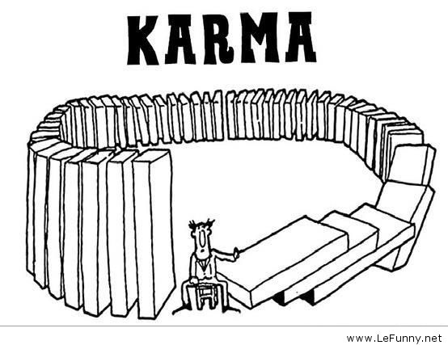
```

Systems Theory can be informative for data science for a number of reasons:

1. Domain knowledge is an important aspect of data science. The data do not "speak for themselves".
2. Systems do exhibit general properties such as "increasing returns" or "decreasing returns" and it is important to be able to identify when the system you are working with is exhibiting one of these properties.
3. The tools of Systems Thinking can be used to refine a collective understanding of Context and Vision (CoNVO).

In this chapter we discuss Systems Theory, specifically, a qualitative modeling technique called "Causal Loop Diagrams" that originated with System Dynamics.
We focus on the Causal Loop Diagram (CLD) because:

1. A Causal Loop Diagram enables you to extract domain knowledge from stakeholders and interested parties (Context).
2. All data comes from some real world process. A Causal Loop Diagram is a qualitative way of making your thinking about that process concrete (Context).
3. A Causal Loop Diagram then helps you develop suitable quantitative models (Need).

In my experience, the first weeks and sometimes months of a new job or orienting a new team member involves figuring out the domain vocabulary, data locations and availability as well as basic goals of the organization.
In other words, you acquire domain knowledge.

Now, while I cannot teach you the domain knowledge you need for your particular job, it turns out there are some well understood principles that all domains more or less follow.
I find there are some *general* techniques for thinking about problems that fit very well with Data Science and are worth knowing.
Once such technique is *Systems Theory* or, more specifically, *Systems Dynamics*.
Systems Dynamics covers a wide range of modeling techniques.
I am going to go over only one and I'm not even going to suggest that you follow it *exactly*.

The main goal is to make your thinking about the domain concrete and be able to share it with others.
This is really helpful for rooting out stakeholders with differing mental models of what's happening or what needs to be done.
Otherwise, there is a tendency for everyone to believe that they're talking about the same thing or leave everything at vague generalities.

But probably most importantly for us, it turns out this technique is a good basis for talking about what our data is and where it comes from (the data generating process) and ultimately what your models are about (and, in some cases, how they might affect the real world).

## System Dynamics

It turns out that we, *homo sapiens sapiens*, aren't particularly good at understanding relationships involving more than a handful of variables with more than one or two degrees of separation.
We get simple cause and effect but when we start adding more variables and feedback loops, we get lost quickly.

[System Dynamics](https://en.wikipedia.org/wiki/System_dynamics) was originally developed by Jay Forrester as a technique to help managers better understand the system they were managing.
The basic approach is to identify key variables of the system and their influences on each other and model them with a set of differential equations.
More specifically we look at *levels* (population, industrial capacity, atmospheric carbon) and *flows* (births, deaths, new products, output).
Given the parameterization of the model, the point is not to see if Gross Domestic Product is estimated to be $500 trillion or $600 trillion next year.
The point is to see the *pattern* in the behavior of GDP, whether it goes up or down or whether it oscillates.
The relative values of the parameters can often produce widely different outcomes, even for the same model structure.
And this is the interesting thing about System Dynamics.
It basically says something like, "I don't care if you're talking about an economy or a cell in the body or a corporation. There are general systematic patterns at work when two flows are working against each other.".
Today, there are software packages available to develop these models graphically and then simulate them.

The first use of System Dynamics (all computations by hand!) was probably Forrester's consulting work with GM to explain a 3 year cycle in employment at a Kentucky GM plant.
The most famous application of System Dynamics was the Club of Rome's [Limits to Growth](https://en.wikipedia.org/wiki/The_Limits_to_Growth) report published in 1972.
Limits to Growth criticized when it first came out but the general path of the predictions for "business as usual" appear to be on track.
Unfortunately, this particular scenario predicts [economic collapse](https://www.theguardian.com/commentisfree/2014/sep/02/limits-to-growth-was-right-new-research-shows-were-nearing-collapse) around 2050 (give or take).
[Systems Dynamics](http://mitsloan.mit.edu/group/system-dynamics/) course is still taught at MIT by Forrester's students and their students.

There's a lot more to System Dynamics than than what we'll discuss here.
For example, there are *archetypal* patterns in complex systems.
Additionally, Donella Meadows identified [12 leverage points](https://en.wikipedia.org/wiki/Twelve_leverage_points) in a system.
My personal view is that System Dynamics contains many of the most useful insights of economics (for example, decreasing returns) and more.

While Stock and Flow Models are interesting, the more qualitative aspects of Systems Dynamics are sufficient for what we want to accomplish: flesh out the relationships between the variables in our systems and create a shared understanding.
For example, if you're trying to investigate one of the Kaggle data science use cases, say, training recommendations in an HR context or monitoring contractor performance in construction, then we want to be able to quickly sketch out the main relationships of this system in order to develop the context, need and vision (CoNVO).

For this purpose, I think that System Dynamics' Causal Loop Diagrams (CLD) are a useful tool.
They can be used during the early stages of context and need identification with domain and subject matter experts, stakeholders, and other analysts.
They can improve communication, by establishing a shared mental model of the system being evaluated or manipulated, and bring to light unknown factors and hidden assumptions.
And, perhaps more importantly, they can be used even if it's just you.
As we will see later, understanding the system is imperative to all steps in the data science process.
CLDs can help in a number of ways:

1. It represents a shared understanding of the domain knowledge.
2. It represents a mental or qualitative model of where the data is coming from.
2. It represents parts of the system that may have been "assumed away" or "simplified".
3. It represents a broader context for evaluating the success or failure of a data science solution.

First, it's one thing for people to say "sending more email creates more sales" and another thing to start actually specify a system where that's true.
CLDs give you a notation for describing a system and its parts as well as the influences of each part.
It also provides a broader context for data-based story telling.

Second, data is not just columns of numbers and symbols.
Data is generated as observations (direct or indirect) of a system in motion, a process.
Taking the time to actually specify the system that is generating the data will help you understand the data better.

Third, when we build statistical or machine learning models, we often do not have all the information we would like (either because we didn't get it or we can't get it) or because we chose not to include it.
With a CLD, we have a baseline of comparison for what we did not, could not, or would not include.
At the data collection stage, this can be a warning to us that something doesn't seem right ("why are there values for this variable above 10?") or at the modeling stage, that something may be wrong or unexpected ("we thought this relationship would be positive and the coefficient is negative. We need to check the data.").

Fourth, and this relates to the second, it may turn out that an email campaign that tested well, flops utterly when scaled.
Why?
We often assume the world is unchanging or *stationary* when it is not.
Perhaps a competitor got wind of the email campaign and launched their own advertising blitz that neutralized it.


Finally, when talking about systems it's convenient to have a notation for describing the system and that's where Causal Loop Diagrams come in.

But first let's start at the beginning.
What is a system?

## What is a System?

What is a [System](https://en.wikipedia.org/wiki/System)?
Good question.
At this point we simply defer to Wikipedia:

> Some systems share common characteristics, including:

> * A system has structure, it contains parts (or components) that are directly or indirectly related to each other;
* A system has behavior, it exhibits processes that fulfill its function
or purpose;
* A system has interconnectivity: the parts and processes are connected by structural and/or behavioral relationships;
* A system's structure and behavior may be decomposed via subsystems and sub-processes to elementary parts and process steps;
* A system has behavior that, in relativity to its
surroundings, may be categorized as both fast and strong.

> The term system may also refer to a set of rules that governs structure and/or behavior. Alternatively, and usually in the context of complex social systems, the term institution is used to describe the set of rules that govern structure and/or behavior.

Systems are often part of larger systems (and systems often have smaller parts that are themselves systems).
A cell is a system.
The digestion of food is handled by a system (even though it includes cells).
A person is a system (even though it has a digestive system).
A family is a system (even though it includes persons).
And so on.
As Carl Sagan said, "if you want to bake an apple pie from scratch, you must first create the universe."

Where you draw the line depends on what level of behavior you're interested in (we'll have a bit more to say about this later).
I recommend going out one or two layers just beyond the immediate interest or control.
If you stop at what you're interested in or what you can directly control, you may well leave out important parts of the system and their interactions.
Going slightly "bigger" or "wider" also helps you be more certain that your simplifications are either warranted or document exactly what was assumed away.

## Causal Loop Diagram

A Causal Loop Diagram is, at its most basic, a directed graph.
Unlike such constructs such as Bayesian Networks, a CLD *may* have cycles.
In fact, the presence of cycles is what makes System Dynamics unique.

Variables are indicated by nodes or vertices as in the first graph of \@ref(fig:systems-fig1).
In Figure 1, both A and B are variables.
In the next graph, we see that A influences B.
Arcs indicate influence between two variables with the arrow indicating the direction of influence.
All arcs have a *polarity* notation near the arrowhead indicating "positive" (+) or "negative" (-) polarity.

Polarity is established by mentally walking through the (causal) influence of A on B.
When A increases, what happens to B?
If B also increases, then the polarity is positive.
It's very easy to misread a CLD and believe that the plus sign (+) indicates "increase", that B increases no matter what happens to A.


```{r systems-fig1, echo=FALSE, out.width='35%', fig.align='center', fig.cap='Two Variables with Positive Polarity'}
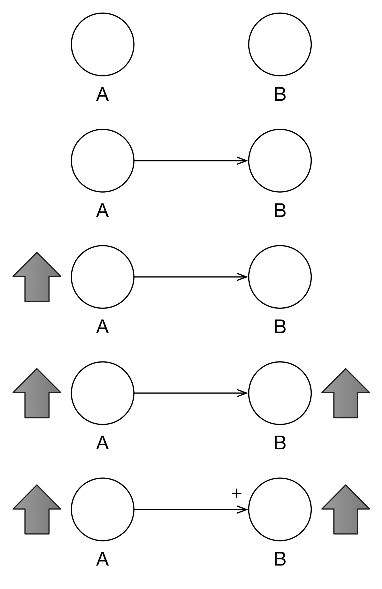
```

Looking at \@ref(fig:systems-fig2), we see what happens when A decreases, B also decreases.
Positive polarity indicates that two variables move in the same direction.
Actually, in the "old days", polarity was indicated by "S" (for same) and "O" (for opposite).

```{r systems-fig2, echo=FALSE, out.width='35%', fig.align='center', fig.cap='Positive Polarity Works Both Ways'}
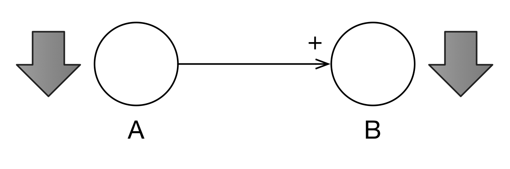
```

In \@ref(fig:systems-fig3), we establish that a different relationship between A and B.
if A increases, B decreases.
This is the negative polarity as indicated by the negative sign near the arrowhead.

```{r systems-fig3, echo=FALSE, out.width='35%', fig.align='center', fig.cap='Negative Polarity Indicates an Opposite Reaction'}
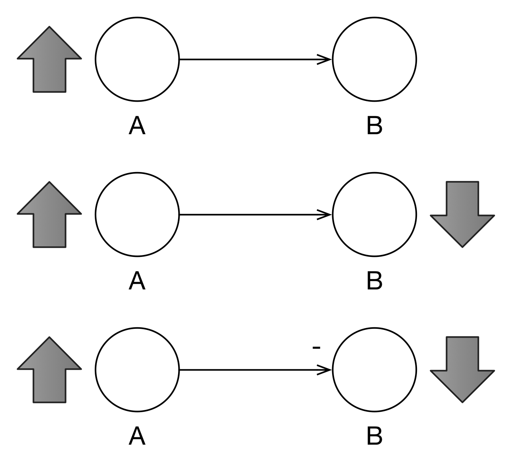
```

In \@ref(fig:systems-fig4) we can see that A can influence B and, simultaneously, B can influence A.
Such cycles--called *feedback loops*--are an important part of System Dynamics.
The (+) in the middle indicates that this is a *reinforcing* feedback loop (which we will also indicate with (R)).
In such a feedback loop, the interactions of the variables reinforce each other: A increases which causes B to increase which causes A to increase and so on.

```{r systems-fig4, echo=FALSE, out.width='35%', fig.align='center', fig.cap='Population Model'}
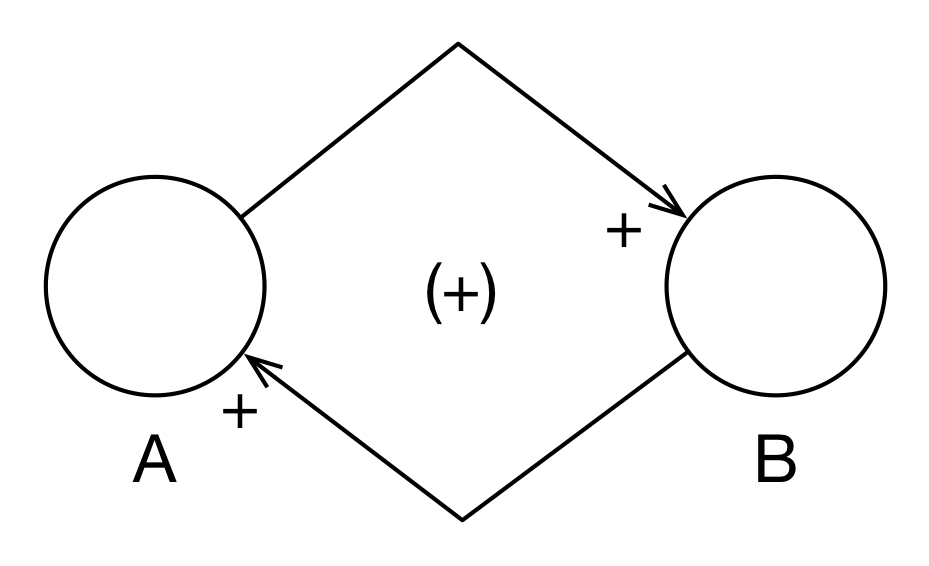
```

If there are arcs in the feedback loop with negative polarities, then we may have a *balancing* feedback loop (- or B) as in \@ref(fig:systems-fig5).
This is fairly easy to figure out with only two arcs in the loop, but how does it work with many arcs?
The rule of thumb is that if there are an *odd* number of negative arcs in the loop, then the feedback loop is balancing; otherwise, it is reinforcing.

```{r systems-fig5, echo=FALSE, out.width='35%', fig.align='center', fig.cap='Balancing Feedback Loop'}
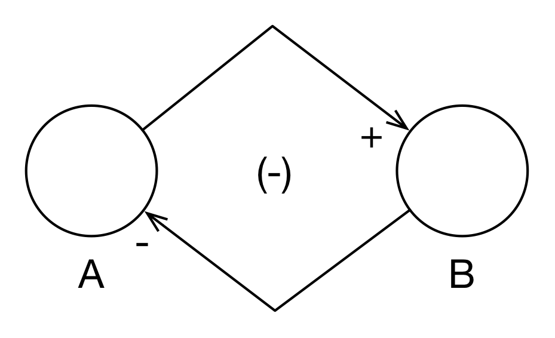
```

Let's see a simple example of CLD modeling using subject matter with which everyone is familiar: life and death.
In Figure 6, we see a simple population model with three variables: births, populations, and deaths.
There is a positive arc from births to population because when births increase, population increases.
There is a positive arc from population to births because when population increases, births increases.
However, they do not increase right away but with a delay.
This delay is indicated by the two strikes on the arc, "||".
Because there are no negative arcs (an "even" number), this is a reinforcing feedback loop as highlighted in the 2nd graph of Figure 6.

Similarly, as population increases, deaths increase and so that arc has a positive polarity.
Because members of the population do not die instantly, there is a delay on the arc.
However, as deaths increase, population decreases and so *that* arc is negative.
Because there is one odd negative arc, this is a balancing feedback loop (3rd graph of Figure 6).

```{r systems-fig6, echo=FALSE, out.width='35%', fig.align='center', fig.cap='Simple Population Model'}
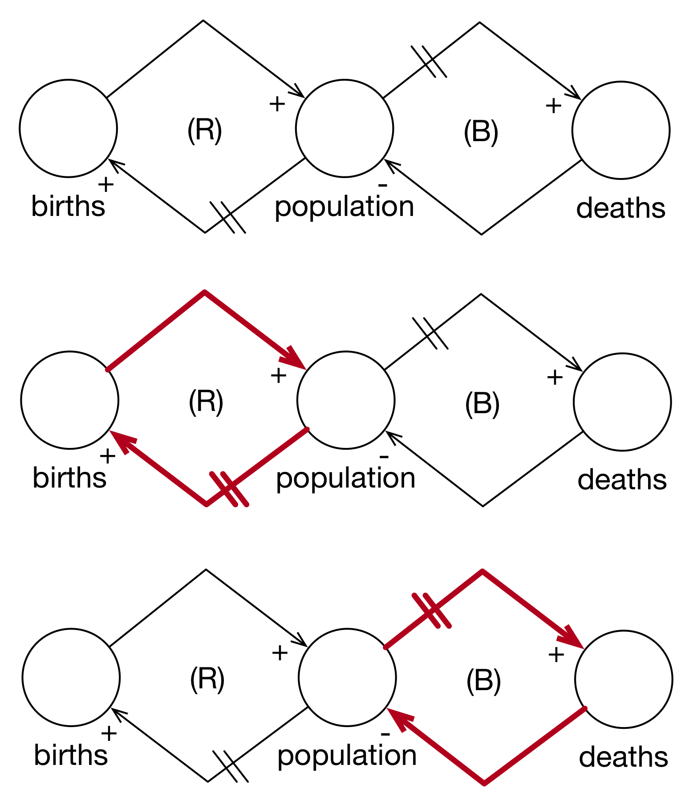
```

Although this is only a simple model, we can see a few interesting things.
First, population itself is kept in check by the relative strengths of the two feedback loops.
Second, from a modeling perspective, there are a number of parameters that are exogenous to the system: puberty, birth rates, lifespans, and death rates.

However, we can endogenize a number of these variables by including them as factors in our diagrams.
In \@ref(fig:systems-fig7), we add at least one perspective on birth rates.
Starting with population, when population increases, resources per person decrease (negative polarity).
When resources per person increase, life expectancy increases (positive polarity).
When life expectancy increases, the desired family size decreases (negative polarity).
When desired family size increases, births per person increase (positive polarity).

It is very important to look at *pairwise* relationships.
At this point, we're not following the causal chain yet.
There is a natural tendency to want to "run" the model while you build it.
For example, we could have taken the "desired family size decreases" and applied it to "births per person" but we would have almost certainly confused ourselves.
It's easiest to simply take each relationship in isolation and start, "When this variable increases, what does that variable do?".

When births per person increases, then births increase (positive polarity).
Finally, when births increase, the population increases (positive polarity).
Because we have two negative polarity arcs in the loop, this is a reinforcing feedback loop.

```{r systems-fig7, echo=FALSE, out.width='50%', fig.align='center', fig.cap='Endogenized Birth Rate'}
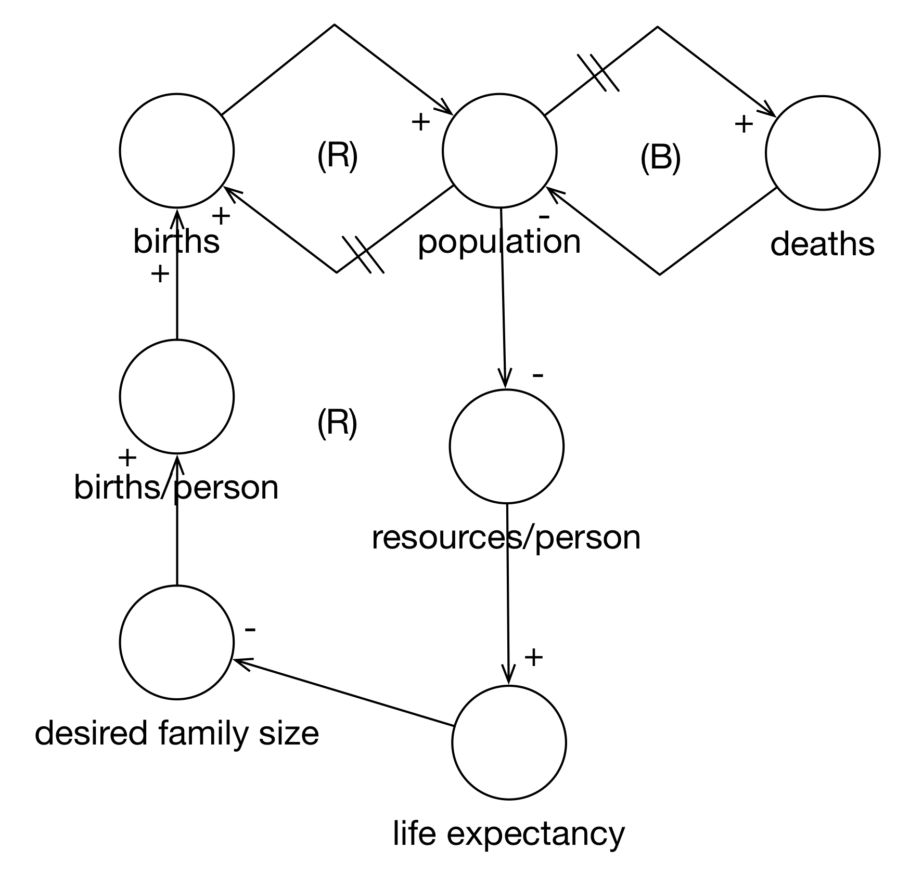
```

Now, let's mentally simulate the model.
When population increases, resources per person decrease.
This causes life expectancies to decrease.
As life expectancies decrease, desired family sizes increase.
As desired family sizes increase, there are more births per person.
As births per person increase, overall births increase.
This increases population (which decreases resources per person...).

In this way, we have endogenized birth rates (although not puberty).

```{r systems-fig8, echo=FALSE, out.width='50%', fig.align='center', fig.cap='Simulating the Expanded Birth Cycle'}
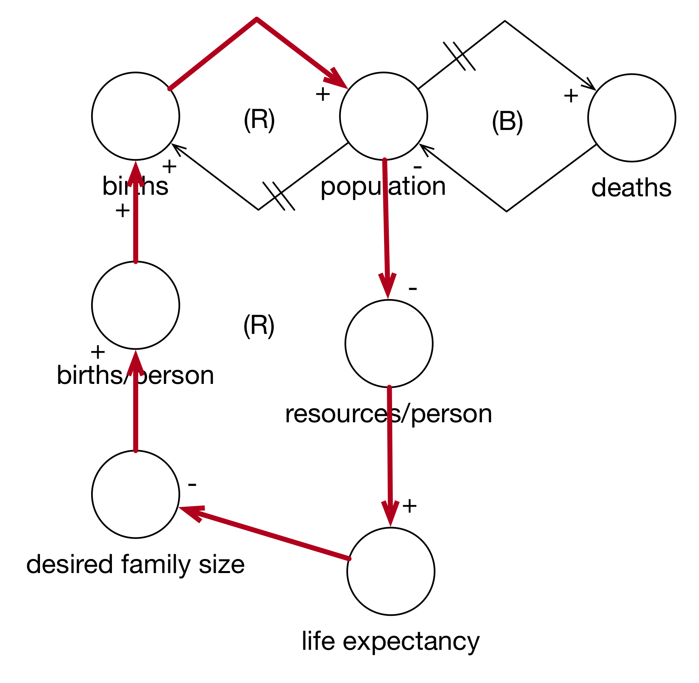
```

Next we look at death rates in \@ref(fig:systems-fig9).
This is a lot simpler.
As life expectancy increases, deaths decrease (negative polarity).
With three negative polarity arcs, the entire loop is a balancing feedback loop.

```{r systems-fig9, echo=FALSE, out.width='50%', fig.align='center', fig.cap='Endogenized Death Rate'}
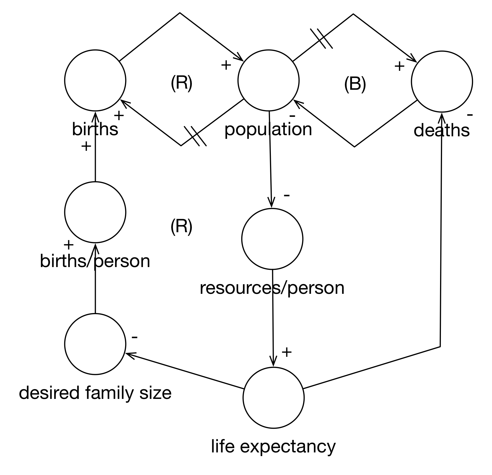
```

Finally, you can follow the entire cycle in \@ref(fig:systems-fig10).

```{r systems-fig10, echo=FALSE, out.width='50%', fig.align='center', fig.cap='Simulating the Expanded Death Cycle'}
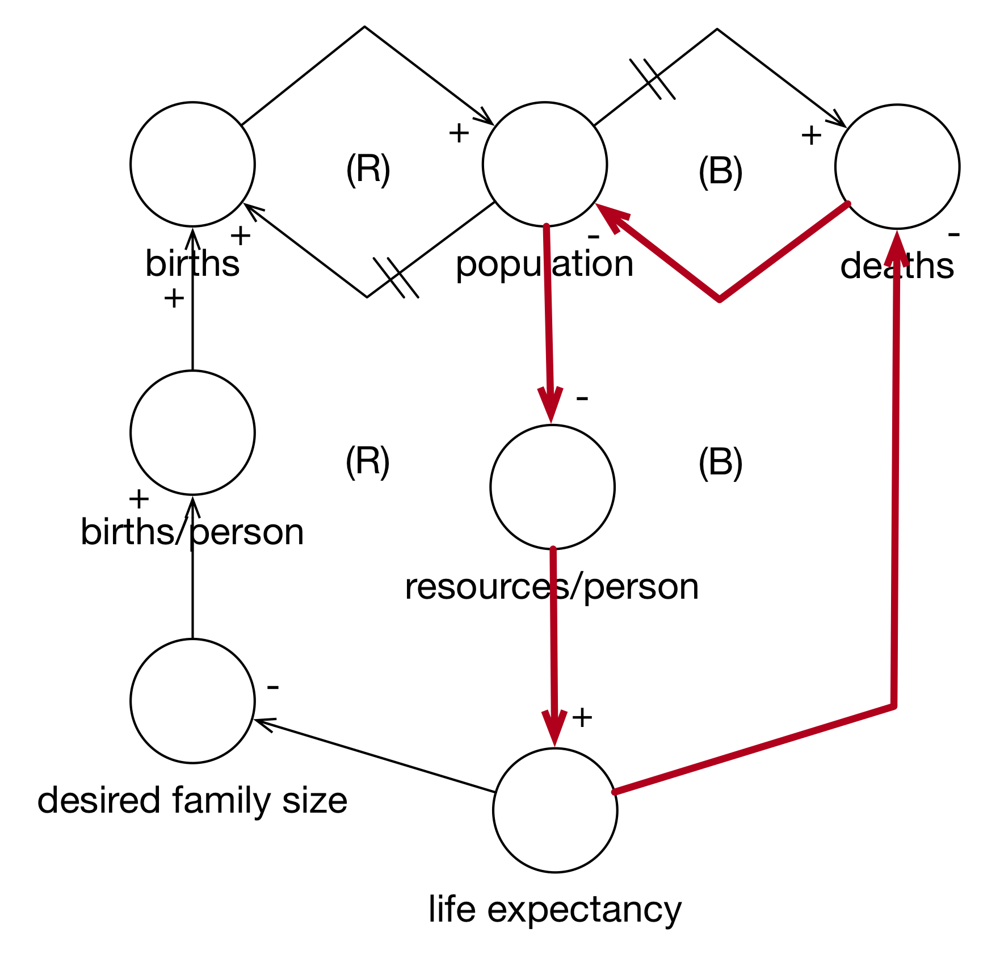
```

Note how we started simple and then expanded the model by endogenizing the birth rate and the death rate.
Starting simple is a good way to track your progress.
Also note that the characteristics of the feedback loops did not change.
If, after you expand a model, the feedback loop flips from reinforcing to balancing (or vice versa), you should re-evaluate what you've done: was the initial model wrong because it left out details or is there something wrong with the new model.
In general, however, this is typically how you'll proceed.

As a model is developed, what was an exogenous parameter can become an endogenous variable.
You should not get bogged down in the process, however.
This is only a tool.
My suggestion is that if you are starting with the problem (either alone or on a team), start creating a causal loop diagram so that you can all clarify your mental model of the problem, the needs, vision and outcome.

If you are starting with the data, go back and try to build the CLD that gives rise to the data you have even if it means adding variables that you *do not* have have data for.
This will clarify your thinking about the data you have and the relationships you expect to see.

I should also note that proper CLDs only have *numerical* variables or features.
You will not generally see a variable labeled "gender" or "political party".
For example, men and women have different life expectancies.
I think it's fine to include these *categorical* variables in a Causal Loop Diagram either as variables or parameter.
However, if you can think of a numeric representation of the variable, "social conservatism" instead of political party, you should use it if that is what you really mean (it's possible that "political party" would then be a *proxy* for social conservatism in your actual model).

Another approach is to change a categorical variable into a multiple binary variables.
Here we could change political party to Democrat and think of the variable as a switch.
If we switch it on, what happens to the other variable?
If another variable increases, does the Democrat variable get switched on or off?
The solutions are imperfect but it can be made to work.

Let's walk through a few more examples in order to get feel for the approach.
First, let's take a look at the famous "Heroin Model" and see why CLD can be very important for Data Science.

## Heroin Model
This is a fairly famous application of System Dynamics to a public policy problem.
It dates from the 1970s but is topical with the resurgence in heroin use as a result of the opioid crisis.
There are a few things I'd quibble with both in the Original and Revised Models but let's accept them for now.

Figure 11 shows the original model for the heroin cycle in the Bay Area of California (I think it was Berkeley or Oakland).
Let's walk through the three main loops of the model starting with "heroin supply", first looking at the pairwise relationships in the arcs between variables.
When the heroin supply increases, crime increases (positive).
When crime increases, police activity increases (positive).
When police activity increases, heroin seizures increase (positive).
When heroin seizures increase, the heroin supply *decreases* (negative).
The entire loop is *balancing* because there is a single negative arc.

The next loop also starts from heroin supply.
As the heroin supply increases, the heroin trade increases (positive).
As the heroin trade increases, police activity increases (positive).
We've already seen the rest here.
Because there is only one negative arc, the entire loop is balancing.

Finally, the third loop also builds off the heroin supply.
As the heroin supply increases, the number of dealers increases (positive).
As the number of dealers increase, the number of addicts increases (positive).
As the number of addicts increases, the heroin trade increases (positive).
This third loop is also balancing because there's only the single negative arc between seizures and heroin supply.

Because all three loops are balancing, the entire system is self-correcting.
In essence, if there is no heroin supply, there won't be dealers, addicts, or crime.
At the time, police activity was identified as a *leverage point* in the system because police activity could be changed independent of the rest of the system (through extra patrols, tougher enforcement, etc.) and it could directly affect seizures and thus the heroin supply.
This became the policy.
Both crime and the heroin trade increased, instead of decreasing.
What went wrong?

```{r systems-fig11, echo=FALSE, out.width='50%', fig.align='center', fig.cap='Original Heroin Model'}
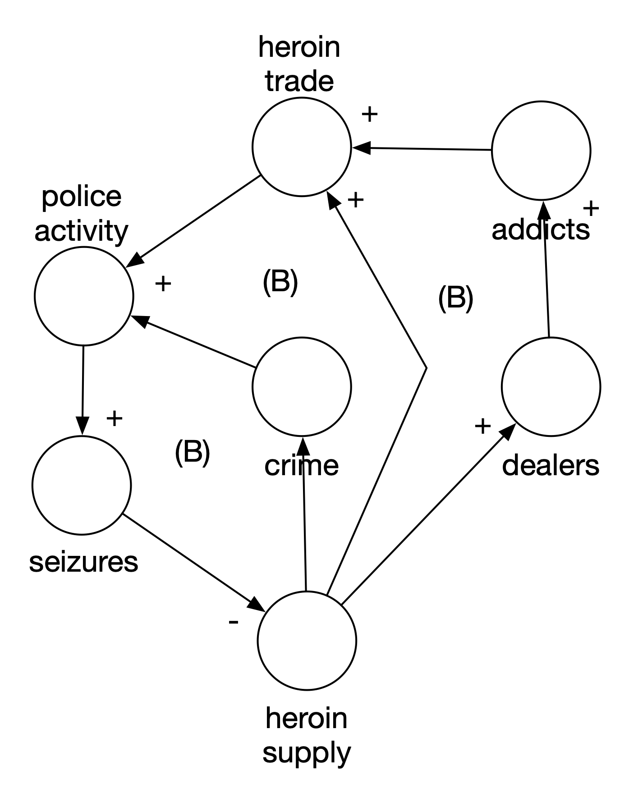
```

The main problem was a failure to identify a key variable of the system: the price of heroin.
As Figure 12 shows, an increase in the supply of heroin decreases the price.
But, more relevant to the problem, a decrease in the supply of heroin increases the price.
And what does policy activity do?
With the increase in price, the heroin trade increases (more dealers are attracted).
It also directly influences criminal activity because the price per addict is higher.
This leads to more burglaries and theft.
The main failure here is to recognize how price and price elasticity would influence the market and trade for heroin.
Increased police activity actually made things worse because all the loops are actually reinforcing loops.
Police activity wasn't the leverage point we thought it was.

```{r systems-fig12, echo=FALSE, out.width='50%', fig.align='center', fig.cap='Revised Heroin Model'}
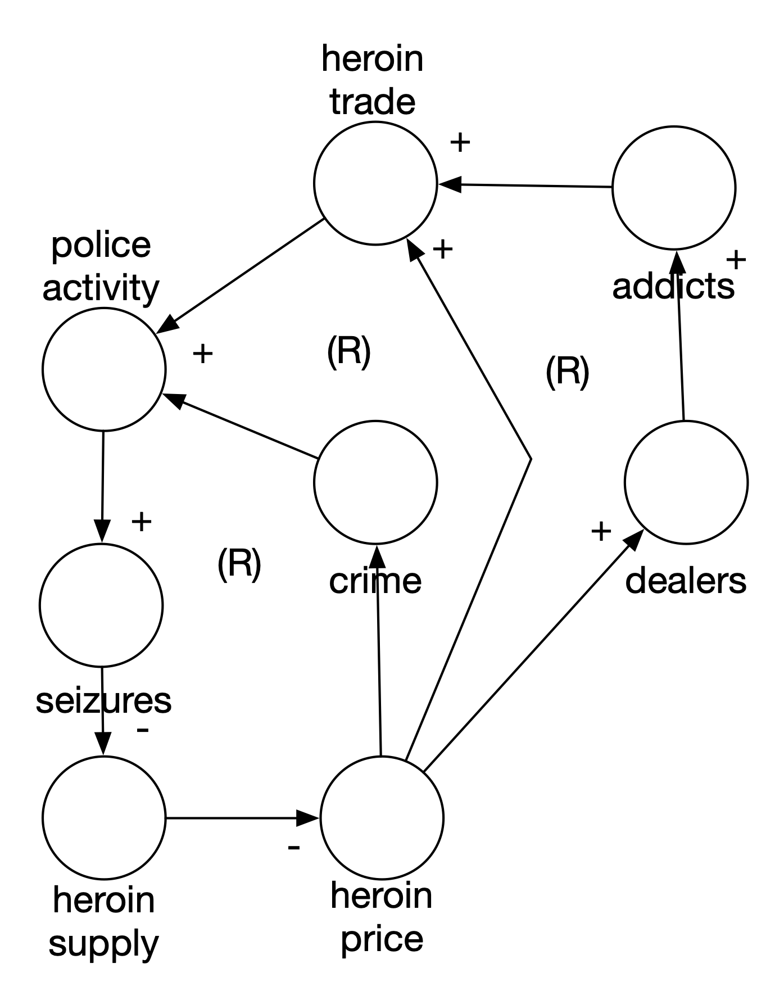
```

Does this mean that System Thinking failed? No. The main lesson here is that you might and will get your model wrong but by having it written down, we can at least see what each other is thinking.

## Email Model
This scenario is not so much about a failed model as a failure to model.
At Company X, we made our living, more or less, by sending emails to our subscribers.
Figure 13 shows the simplest possible model for this relationship.

```{r systems-fig13, echo=FALSE, out.width='35%', fig.align='center', fig.cap='Simplistic Email Model'}
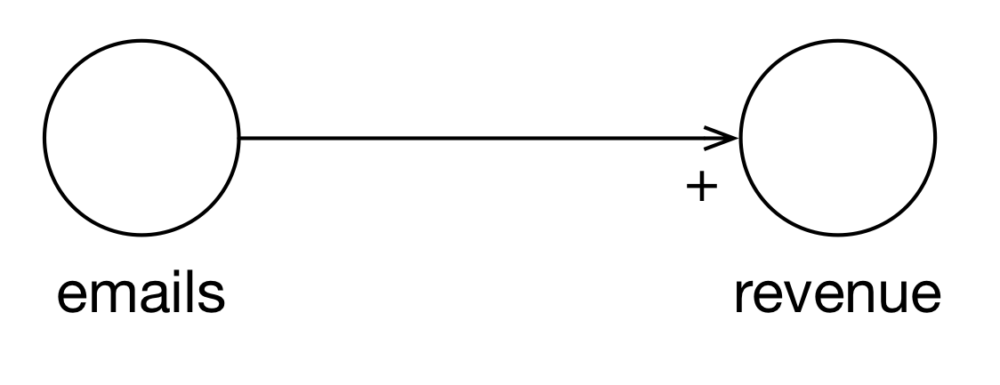
```

The problem with this model is that it is much too simple.
If this is your mental model, you can use it to achieve any target revenue revenue you'd like by simply dividing the revenue target by revenue per email and sending that many emails.
This model entirely ignores the process in which emails and subscribers exist and revenue arises.
Would the stakeholders have noticed how simplistic their model was if we had written it down just like this?
An interesting question.


So how can we make the model more realistic.
First, we recognize that we're sending emails to a list of subscribers.
Second, we recognize that whenever you apply an action to a fixed resource (the list of subscribers), you can experience constant, increasing, or decreasing returns.
Here domain knowledge from the Marketing department says that we experience diminishing returns.
Why?

Figure 14 shows a more in-depth model of the email/purchase process.
We start with subscribers.
If we increase subscribers, we can increase the number of emails.
If we increase the number of emails, the number of unsubs increases.
An increase in unsubs will decrease the number of subscribers.
This is an important feedback loop that was missing in the original model.

We are also constrained by inventory.
If we have one item in our inventory, we can't very well send a single person 20 emails about it.
An increase in inventory increases the number of emails we can send.

An email isn't a thing by itself.
An email is sent at a specific time, with a subject line and content.
All of these influence whether an email leads to a purchase or not.
An increase in emails, increases the number of emails that are opened.
An increase in the number of opens leads to an increase in clicks.
An increase in clicks leads to an increase in purchases.

Finally, we can influence some of these things using personalization.
If personalization "increases" (gets better) then opens increase (because they have better subject lines) and clicks increase (because they have better content).
With an increase in inventory, we get an increase in personalization (we have more things to choose from to show you).
An increase in purchases permits us to personalize better.
This concept is called "revealed preferences" (you tell us the kinds of things you like by buying them).

```{r systems-fig14, echo=FALSE, out.width='60%', fig.align='center', fig.cap='Realistic Email Model'}
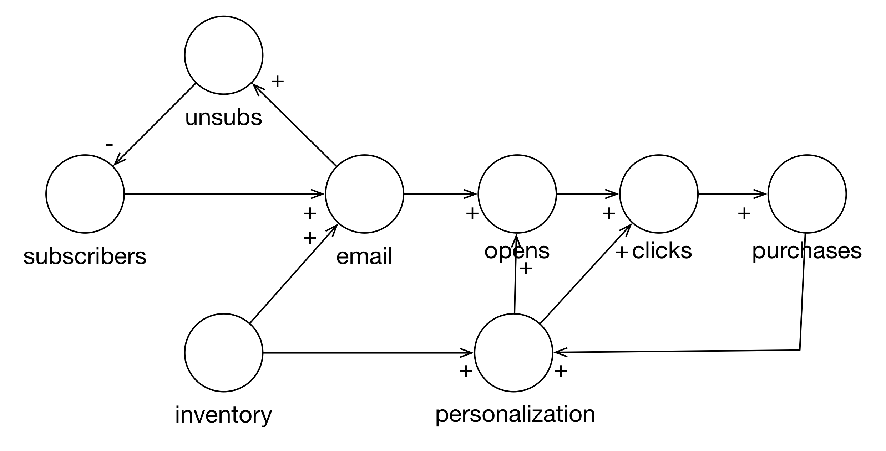
```

Now, what does this say about sending emails?
If we use emails as a leverage point (if we just change--increase--the number of emails we send), then subscribers goes down.
We also see that opens, clicks, and purchases go up but here we have the diminishing returns.
The increase in purchases at the one end will eventually be offset by the loss of subscribers.

This new model isn't perfect.
For example, I don't believe it captures all aspects of diminishing returns.
You can't send someone 20 emails a day about the same five things.
You probably can't send 20 emails a day about five completely different things.
It isn't clear to me how to capture that.
But at least the limitations are made clear in the discussion.

Additionally, we can get new subscribers through marketing and buying email lists.
The interesting challenge here is that there are probably diminishing returns with new subscribers as well.
Given the typical adoption curve and your place on it, the most enthusiastic customers for your product have already joined.
This means that if you are adding truly *new* customers, they are going to be late adopters and perhaps harder to convince to buy your products.

Nevertheless, the model is a start.
By modeling the different parts of the email/purchase process, we can start measuring them and monitoring the health of the system as well as improve it.
It serves as a foundation for communication between Finance, Marketing, and Data Science.

## Conclusion

Data Science is using math and computers to solve a problem that stems from a lack of knowledge. We can frame the application of data science in terms of the context, need, vision and outcome (CoNVO).

However, for any particular application of data science, we need to have domain knowledge.
One way to frame that domain knowledge is in terms of understanding the system in which we are operating.
If our CoNVO leads us to build a model of at-risk youth, we should understand the system in which this process is taking place.

Systems Thinking is general approach to think about the processes as interrelated,
changing parts.
System Dynamics is a particular approach to Systems Thinking.
Stock and Flow Diagrams and Causal Loop Diagrams are models that System Dynamics uses to talk about systems and their evolution.

Causal Loop Diagrams are a very useful tool for framing all aspects of the data science process.

1. They allow the team and stakeholders to share their mental models of the process being studied or acted upon.
2. They help us make sure we're just simplifying and not being simplistic.
3. They help identify data that we need or what we should model.
4. They keep us honest about the degree to which we can really intervene in a particular system or how our interventions are likely to fail.

One of the most famous examples the non-linearity of systems comes from the 1970s. In San Francisco (IIRR), the police started cracking down on heroin dealers with the hope of lowering drug abuse.
Instead, burglaries and other petty crimes increased.
Why?
Cracking down on heroin dealers caused the price of heroin to increase.
This increased price caused theft to rise because addicts needed more money to pay for the increased price of heroin.

"hi-tech" modeling techniques like boosted random forests and deep learning do not excuse the data scientist from understanding the system they're modeling or hoping to control.

## Review

1. Why is domain knowledge controversial in some data science circles?
2. Why are **Causal Loop Diagrams** helpful for data science?
3. How do Causal Loop Diagrams fit into our overall "CoNVO" model for describing successful data science projects?
4. The main components of a Causal Loop Diagram are: **variables**, **influence arrows** and **polarity arrows**.
    1. If there is an arrow from variable A to variable B with a "+" sign at the arrow head, what does that mean?
    2. If there is an arrow from variable B to variable A with a "-" sign at the arrow head, what does that mean?
    3. Taken together, what kind of **feedback loop** does the above arrangement describe?
    4. If, instead, the arrow from variable B to variable A had a "+" annotation, what kind of feedback loop would that describe?
5. What are the difficulties associated with **categorical variables** and Causal Loop Diagrams? What are some of the ways we can get around them?

## Exercises

1. Add the potential for getting new subscribers to the email model. How do you add the adoption curve to the model?
2. Find a problem from work or that interests you and see if you can draw a Causal Loop Diagram for it. Share it with someone who has an opposing viewpoint. Share it with someone who has the same viewpoint. What assumptions do you have in common? Do you disagree on the polarity of any arcs? Is there "violent agreement" on anything?


## Additional Resources

[Limits to Growth was Right: New research shows we're nearing economic collapse](https://www.theguardian.com/commentisfree/2014/sep/02/limits-to-growth-was-right-new-research-shows-were-nearing-collapse) (news)

[Systems & Us](http://systemsandus.com/) (site)

[Overview of Causal Loop Diagrams](https://www.youtube.com/watch?v=WDqVZ9VV4Kg) (video)

[Brief Overview of Causal Loop Diagrams](https://www.youtube.com/watch?v=EjC6xv9PT9Y) (video)

[Causal Loop Diagrams](http://blackboard.jhu.edu/) (course materials, pdf)

[Vensim]( http://vensim.com/free-download/) (software)

[The Evolution of Systems Thinking](https://slideplayer.com/slide/3340958/) (slides)

